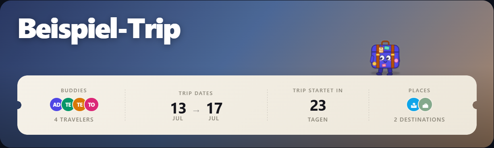

# Koffi

> A tiny animated suitcase mascot that lives on your boarding pass.

## What it does

Koffi is TREK's mascot — a little vintage suitcase with travel stickers, a
swinging luggage tag, and big friendly eyes. He walks along the top edge of the
dashboard's boarding-pass bar, looks around, waves at you, reads his map, naps
(only when there's plenty of time), rolls a stretch in trolley mode, and
collects passport-stamp stickers.

He also reacts to your actual trip: the closer the departure, the more excited
he gets — under 7 days he jumps for joy and his luggage tag flips into an
airport-style split-flap countdown; while the trip is running he puts on tiny
sunglasses. Vacation mode.

## Screenshots

## Permissions

| Permission | Why this plugin needs it |
|---|---|
| `db:read:trips` | To read the current trip's start/end dates so Koffi knows how excited to be. The read is membership-checked by TREK, so he only ever sees a trip you already have access to. |

No network access, no data storage of its own — Koffi just vibes.

## Setup

None. Enable plugins on your instance (`TREK_PLUGINS_ENABLED=true`), install
and activate Koffi, and he appears on the boarding-pass bar of your dashboard
hero. He respects `prefers-reduced-motion` (static pose, no locomotion).

Requires TREK ≥ 3.2.0 (hero widget slot).

## Building

Plain JS/HTML — no build step. `server/index.js` is the plugin entry;
`client/index.html` is the mascot iframe.

## License

MIT — see the TREK repository.
