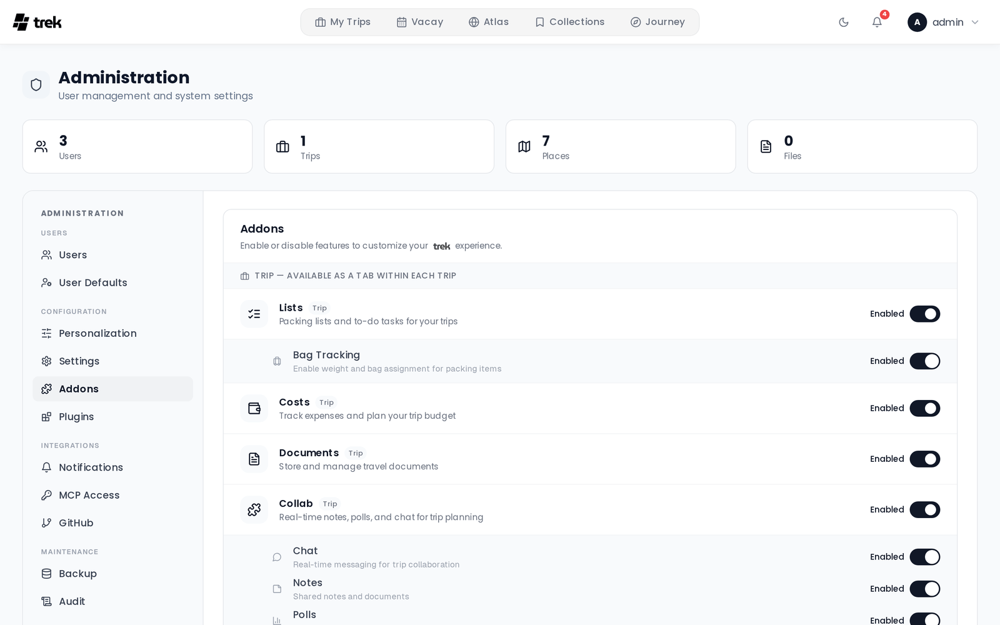

# Addons Overview

Addons are optional features that an admin can enable or disable for the entire TREK instance. When an addon is disabled, its navigation tabs, menu items, and API routes are hidden from all users.

## What addons are

Each addon extends TREK with functionality beyond the core trip-planning features. Addons are managed globally — you cannot enable an addon for one user only. Once enabled, the feature becomes available to all users on the instance.

## Addon list

The following addons are registered in the system (defined in `server/src/db/seeds.ts`; the TypeScript constant `ADDON_IDS` in `server/src/addons.ts` covers all addons except `naver_list_import`):

| Addon ID | Type | Description |
|---|---|---|
| `mcp` | integration | Exposes TREK data and actions through the Model Context Protocol for AI assistant integrations. |
| `packing` | trip | Packing list management — create templates and lists linked to trips. See [Packing-Lists](Packing-Lists). |
| `budget` | trip | Trip budget tracking — log expenses, set budgets, and track spending per trip. See [Budget-Tracking](Budget-Tracking). |
| `documents` | trip | Document and file attachments for trips — store itineraries, visa copies, and other files. See [Documents-and-Files](Documents-and-Files). |
| `vacay` | global | Personal vacation day planner with a year calendar, holiday packs, and collaborator fusion. See [Vacay](Vacay). |
| `atlas` | global | Interactive world map showing countries and regions you have visited, plus a bucket list. See [Atlas](Atlas). |
| `collab` | trip | Notes, polls, and live chat for trip collaboration. See [Real-Time-Collaboration](Real-Time-Collaboration). |
| `journey` | global | Trip tracking and travel journal — check-ins, photos, and daily stories. See [Journey-Journal](Journey-Journal). |
| `collections` | global | A personal, server-wide library of saved places in named lists, with idea/want/visited status, categories, and fusion sharing with per-member roles. See [Collections](Collections). |
| `airtrail` | integration | Sync flights from your self-hosted AirTrail instance into trips. |
| `llm_parsing` | integration | AI Parsing — an LLM fallback that extracts bookings from confirmation files KDE Itinerary can't read. See [AI-Booking-Import](AI-Booking-Import). |
| `naver_list_import` | trip | Import places from shared Naver Maps lists directly into a trip. |

## Enabling addons

> **Admin:** all addons are toggled from the admin panel. Navigate to [Admin-Addons](Admin-Addons) to enable or disable individual addons for your instance.

## Per-addon sub-features

Some addons expose sub-features that an admin can independently toggle. The [Real-Time-Collaboration](Real-Time-Collaboration) addon, for example, lets an admin decide which of its four sub-features (chat, notes, polls, and what's next) are active across the instance. These are configured from the [Admin-Addons](Admin-Addons) panel alongside the addon's main toggle.
