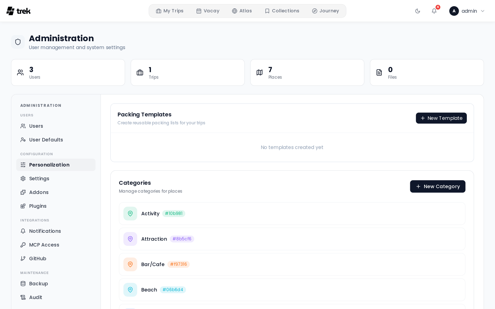

# Admin — Categories

The **Personalization** tab → **Categories** section lets you manage global place categories. Categories are shared across all trips and all users on the instance.

## What categories are

A category is a label consisting of a name, a color, and an icon. Users assign categories to places when creating or editing a place. Categories appear:

- In the place form's category selector
- As colored chips on place cards
- In the places filter panel
- In the map legend

## Creating a category

Click **New Category** (top-right of the category section). A form appears inline:

1. **Name** — required. Free-text label for the category.
2. **Icon** — a scrollable grid of ~47 curated Lucide icons (Pin, Hotel, Restaurant, Transport, Nature, etc.). Click any icon to select it. The default icon is `MapPin`.
3. **Color** — 12 preset color swatches plus a custom color picker (pipette button). The default color is `#6366f1` (indigo). The 12 presets are:

   `#6366f1` · `#8b5cf6` · `#ec4899` · `#ef4444` · `#f97316` · `#f59e0b` · `#10b981` · `#06b6d4` · `#3b82f6` · `#84cc16` · `#6b7280` · `#1f2937`

4. A **live preview** chip shows how the category will appear to users as you make selections.

Click **Create** to save.

## Editing a category

Click the pencil icon on any category row. The same form appears in-place with the existing values pre-filled. Change any field and click **Update**.

## Deleting a category

Click the trash icon on a category row and confirm. Deletion sets `category_id` to `NULL` on any places that had the category assigned — the places themselves are not affected, they become uncategorized.

## List ordering

Categories are always displayed in alphabetical order by name. There is no manual reordering.

## Related pages

- [Places-and-Search](Places-and-Search)
- [Admin-Panel-Overview](Admin-Panel-Overview)
