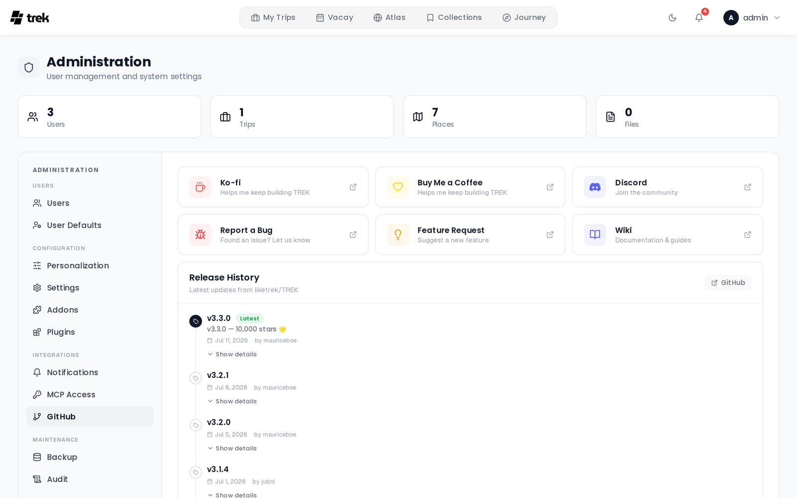

# Admin — GitHub Releases

The **GitHub** tab shows the TREK release history fetched from GitHub and provides links to community resources and support options.

## Support and resources

Six cards at the top of the tab link to external resources:

| Card | Link |
|------|------|
| **Ko-fi** | Support the project financially |
| **Buy Me a Coffee** | Alternative support link |
| **Discord** | Join the TREK community |
| **Report a Bug** | Open a GitHub issue with the bug report template |
| **Feature Request** | Open a GitHub Discussion in the feature requests category |
| **Wiki** | Open the GitHub Wiki |

## Release timeline

Below the support cards, a chronological timeline lists GitHub releases for the `liketrek/TREK` repository. Each entry shows:

- **Version tag** (e.g., `v2.9.14`)
- A **Latest** badge on the first (most recent) entry in the displayed list
- **Release date** and author
- A **Show details / Hide details** toggle that expands the release notes (Markdown rendered inline)

When the running server version is a stable release, pre-release entries are filtered out of the timeline.

Releases load 10 at a time. Click **Load more** at the bottom of the timeline to fetch additional pages.

If the admin API request fails, the timeline section shows an error message. If the server cannot reach the GitHub API, the timeline displays no releases (the server returns an empty list rather than an error).

## Version check

The server checks for available updates daily at 9 AM (server timezone, defaults to UTC) and sends an admin notification when a newer version is published. When an update is available, a banner also appears at the top of the Admin page on next load.

Results are cached for 5 minutes to avoid repeated API calls.

## When to check

Review the GitHub tab before performing an upgrade to read the release notes for any versions between your current install and the target version. See [Updating](Updating) for the upgrade procedure.

## Related pages

- [Updating](Updating)
- [Admin-Panel-Overview](Admin-Panel-Overview)
