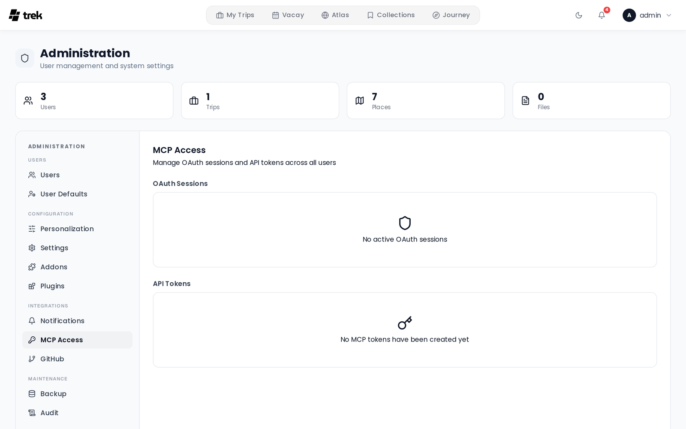

# Admin — MCP Tokens

The **MCP Access** panel shows all active MCP OAuth sessions and API tokens across every user on the instance. As an admin you can revoke sessions and delete tokens.

This panel is only visible when the **MCP addon** is enabled in the [Admin-Addons](Admin-Addons) panel.

## OAuth Sessions

OAuth sessions are created when a user authorizes an MCP client via the OAuth 2.1 flow. These are the recommended way to connect MCP clients to TREK.

**Columns:**

| Column | Description |
|--------|-------------|
| Client name | The name of the registered OAuth client. Granted scopes are shown as badges below the name (up to 6 are shown; click "+N more" to expand) |
| Owner | The username of the user who authorized the session |
| Created | Date the session was established |
| (actions) | Trash icon button to revoke |

**Revoking a session:** Click the trash icon on the row and confirm. The session is invalidated immediately and the revocation is recorded in the audit log. The user's MCP client will need to re-authorize before it can make further requests.

OAuth access tokens use the prefix `trekoa_`.

## API Tokens

API tokens are long-lived tokens that users create in their personal settings. They are identified by the `trek_` prefix.

**Columns:**

| Column | Description |
|--------|-------------|
| Token name | The label the user gave the token, with its truncated prefix shown below |
| Owner | The username of the user who created it |
| Created | Date the token was created |
| Last used | Date of the most recent API call using this token, or "Never" if unused |
| (actions) | Trash icon button to delete |

**Deleting a token:** Click the trash icon and confirm. The token is invalidated immediately. The user must create a new token in their settings if they still need access.

## Related pages

- [MCP-Overview](MCP-Overview)
- [MCP-Setup](MCP-Setup)
- [Admin-Panel-Overview](Admin-Panel-Overview)
