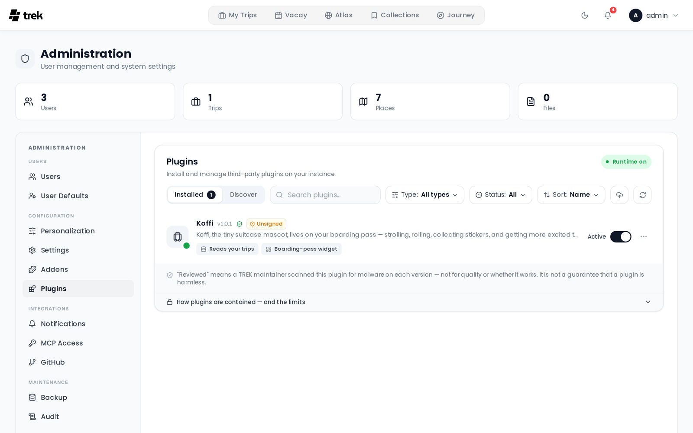

# Admin: Plugins

Install, review, enable, update, and remove third-party plugins on your instance.

## Where to find it

Open the **Admin Panel** and select the **Plugins** tab. *Install and manage third-party plugins on your instance.*

> **Admin:** This whole panel is admin-only. It also needs the plugin runtime turned on — otherwise you get *Plugins are disabled*: **The plugin runtime is turned off (`TREK_PLUGINS_ENABLED`). No plugin can run until an admin enables it in the server configuration.** When the runtime is on, a green **Runtime on** pill appears in the header.

For what plugins are and how users interact with them, see [Plugins](Plugins).

## The two views

A segmented switch at the top toggles between:

- **Installed** — what is on this instance, with a count.
- **Discover** — the community registry, browsable as cards.

Both views share a toolbar: a **Search plugins…** box, a **Type** filter (Widget / Page / Integration / Trip page), a **Sort** menu, an **Upload plugin** button, and a **Rescan** button. The **Installed** view adds a **Status** filter (Active / Off / Update available / Error).

**Rescan** does two things: it rediscovers locally-installed plugins *and* force-pulls the registry, bypassing the 30-minute server cache and GitHub's CDN, so a just-published plugin shows up immediately instead of up to ~35 minutes later.

## Installing from the registry

1. Switch to **Discover**. Each card shows the icon, name, author, description, type, a **Reviewed** badge if applicable, the **Signed**/**Unsigned** badge, the latest version, and a download count.
2. Click a card to open the **pre-install review dialog** (see below).
3. Click **Install**.

If the newest release requires a newer TREK than you are running, the button changes: when an older release still fits you get **Install {version}** for that one; when nothing fits, the button reads **Incompatible** and is disabled. Either way the dialog explains why in an amber note — it does not hide the reason behind a tooltip.

A newly installed plugin is **off**. Nothing runs until you enable it.

### The pre-install review dialog

Before installing, read these sections:

- **What it can access** — the plugin's requested permissions, rendered as plain-language lines ("Read the trips…", "Create and edit places…"). Unknown permission codes appear verbatim. If it asks for nothing, this reads *Needs no special access.*
- **Connects to** — every host the manifest declares it may reach, as monospace chips.
- **Setup** — settings the plugin will ask you (or each user) to fill in, tagged **Instance-wide** or **Per user**, and **Required** where applicable.
- **Details** — version, size, the TREK version range it requires, when it was reviewed, and total downloads.

A footer links to the **Source repository**, **Report an issue**, and the plugin's **Homepage**.

### Operator egress hosts

Some plugins talk to a service only *you* can name — a self-hosted Gotify, ntfy, or similar. Their manifest cannot list a host, so the review dialog adds a **+ hosts you add** chip and this note:

> *This plugin talks to a service only you can name (a self-hosted server). After installing, add the hosts it may reach under ⋯ → Allowed hosts. It can reach no others.*

After install, open the row's **⋯ → Allowed hosts** dialog and add hostnames one at a time. Until you add at least one, the plugin's row shows an amber **Add allowed host** chip, because it can reach nothing and would otherwise look silently broken. Once hosts exist the chip turns blue and counts them.

Saving restarts the plugin so it picks up the new list — a running plugin's allow-list can never be widened in place.

## Enabling, restarting, and disabling

Each installed row has a toggle (**Enable plugin**) and shows **Active** or **Off**. A coloured dot on the icon tile reflects runtime health: active, starting, error, inactive, disabled, or incompatible.

Enabling can be refused for good reasons, each of which opens the right remedy:

- **A required addon is disabled** — a toast names the addon; turn it on in [Admin-Addons](Admin-Addons).
- **A plugin dependency is missing or outdated** — a dialog lists each dependency with a one-click **Download** / **Update** that installs the newest compatible version and then retries.
- **The update widened its permissions** — the consent dialog (below).

Installed-but-disabled dependencies are enabled automatically as a cascade, and a toast tells you which.

The row's **⋯** menu offers **Restart** (active plugins only), **View error log**, **Allowed hosts**, links to the **Source repository** and **Report an issue** for registry plugins, and **Delete**.

## Updating

When a newer version exists, the row grows an **Update → v{version}** button, and a bar above the list reads *{count} updates available for your plugins.* with an **Update all** button.

If the new version requests rights you have not granted, TREK installs it but leaves it off and shows **This update needs new permissions**:

> *{name} v{version} is asking for rights you haven't granted yet. The new version is installed but stays off until you approve it.*

The dialog lists **Newly requested permissions** and **New outbound connections**. Choose **Approve & turn on** or **Keep off for now**. Updating several plugins at once queues these prompts, so none is skipped. If the version being approved is unsigned, the dialog adds a line saying nothing ties it to its author.

### Blocked updates

If an author's signing key no longer matches the one pinned at install, the update is refused and the row shows **Update blocked — {reason}** with a **Review** link. The dialog then shows the pinned key fingerprint next to the offered one:

> *TREK cannot tell a legitimate key rotation apart from a takeover — both look identical from here. Confirm the new key with the author through a channel you already trust before you accept it.*

Only a **changed key** can be overridden (**Trust the new key & update**). A signature that is invalid, missing, or half-declared gets an explanation and **no override button at all** — the server refuses those too.

## Uninstalling

**⋯ → Delete** asks **Uninstall plugin?** — *This stops the plugin, removes its code, and deletes all of its data. This cannot be undone.*

## Badges: what they do and do not guarantee

- **Reviewed** — *"Reviewed" means a TREK maintainer scanned this plugin for malware on each version — not for quality or whether it works. It is not a guarantee that a plugin is harmless.*
- **Signed** — the files were verified against the author's signing key at install, and that key is pinned. A checksum already proves the files are what the *registry* vouches for; a signature proves they came from the *author*.
- **Unsigned** — *The files match what the registry vouches for, but nothing ties them to the author. One guarantee fewer — not unsafe.* Most registry plugins are unsigned today, which is why this is an amber note rather than an alarm.

Neither badge says anything about what the code *does*. A collapsible **How plugins are contained — and the limits** panel at the bottom of the tab spells out the isolation model, what permissions really constrain, what TREK cannot promise, and the worst case. Read it once.

## Sideloading and dev-linking

Two paths install a plugin that never went through the registry:

- **Upload plugin** (toolbar button, or drag a `.zip` onto the panel) — installs the archive **inactive**; you still consent on activation. The row is marked **Sideloaded**: *Uploaded manually — not from the registry, unsigned and unreviewed.*
- **Link a local plugin** — a path field that registers a plugin from a local build directory and hot-reloads it against real data. Dev only, and only shown when the server sets `TREK_PLUGINS_DEV_LINK=1`. The row is marked **Dev-Link**.

Be honest with yourself about what these badges mean: both are only a *label on the card*. They record where the code came from — they do not check, sandbox differently, or restrict it. A sideloaded or dev-linked plugin runs with exactly the permissions it declares, same as a registry one, and it received no malware scan and carries no signature. The badge is there so you can tell at a glance that no one but you vouched for that code. (The source badge also replaces the Signed/Unsigned badge on those rows, since it already says something stronger.)

## Permissions

Every endpoint on this panel requires an admin account, on top of the `TREK_PLUGINS_ENABLED` runtime kill-switch. Dev-link additionally requires `TREK_PLUGINS_DEV_LINK`.

The per-plugin permissions shown in the review and consent dialogs are documented in [Plugin-Permissions](Plugin-Permissions).

## See also

- [Plugins](Plugins)
- [Plugin-Permissions](Plugin-Permissions)
- [Plugin-Development](Plugin-Development)
- [Plugin-Publishing](Plugin-Publishing)
- [Admin-Addons](Admin-Addons)
- [Admin-Panel-Overview](Admin-Panel-Overview)
- [Environment-Variables](Environment-Variables)
- [Security-Hardening](Security-Hardening)
