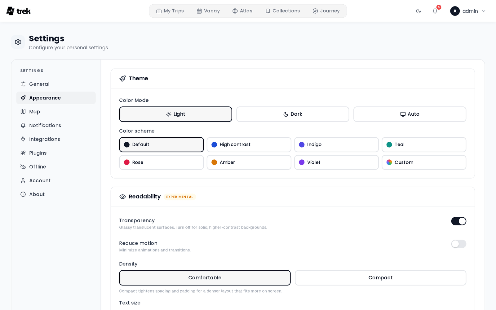

# Appearance Settings

Tune how TREK looks — colour mode, accent scheme, readability, and which dashboard widgets you see.

## Where to find it

Open **Settings** and select the **Appearance** tab.

Changes preview instantly and are saved to your account a moment later, so they follow you to every browser you sign in with. A **Reset to defaults** button at the bottom of the tab restores everything on this page in one click.

> These are personal settings — no permission and no admin toggle gate them.

## Theme

### Color mode

Three segmented buttons: **Light**, **Dark**, and **Auto**. **Auto** follows your operating system's light/dark preference.

### Color scheme

A grid of accent schemes, each with a colour dot that previews in your current mode:

- **Default** — TREK's monochrome look.
- **High contrast** — raises text and border contrast.
- **Indigo**, **Teal**, **Rose**, **Amber**, **Violet** — coloured accents.
- **Custom** — pick your own accent (below).

### Custom accent

Choosing **Custom** reveals a **Custom accent** picker:

1. Click one of the ten preset swatches to set light and dark to the same colour, or
2. Use the **Light** and **Dark** colour inputs to pick a different accent for each mode.

Next to the pickers, a live contrast badge evaluates the accent you are currently seeing against white and shows the ratio:

- **Good contrast (n.n:1)** — the ratio meets WCAG AA for normal text (4.5:1 or better).
- **Low contrast (n.n:1)** — below 4.5:1; white text on that accent will be hard to read.

The badge is advisory. TREK will still let you apply a low-contrast accent.

## Readability

This whole section carries an **Experimental** badge.

- **Transparency** — *Glassy translucent surfaces. Turn off for solid, higher-contrast backgrounds.*
- **Reduce motion** — *Minimize animations and transitions.*
- **Density** — **Comfortable** or **Compact**. *Compact tightens spacing and padding for a denser layout that fits more on screen.*

### Text size

Text scaling works on four axes plus one master control. Every slider runs from **80%** to **160%** in 5% steps, and shows its current percentage on the right.

- **Everything** — a global scale applied on top of the per-tier values.
- **Large** — *Headings, big numbers*
- **Medium** — *Sub-headings*
- **Normal** — *Place names, descriptions*
- **Small** — *Addresses, labels*

Each of the four rows renders a live sample in that tier ("Large heading", "Medium subtitle", "Normal body text", "Small caption / address"), so you can see the effect while dragging.

## Dashboard widgets

*Show or hide dashboard widgets independently on desktop and mobile.* This does not detect your current device — it sets two independent layouts, and the dashboard picks the one matching the viewport it is rendered at. Both layouts are stored on your account, so a change made on your laptop also changes what your phone shows.

### Desktop

- **Below the hero** — **Atlas / countries**, **Trips total**, **Days traveled**, **Distance flown**.
- **Right sidebar** — a master toggle (*The whole right column. Turn off and the dashboard centers.*) with four widgets nested under it: **Currency**, **Collections**, **Timezones**, **Upcoming reservations**. Turning the master off greys the nested toggles out; their individual states are remembered for when you turn it back on.

### Mobile

- **Below the hero** — **Trips total**, **Days traveled**.
- **Bottom of page** — **Currency**, **Collections**, **Timezones**, **Upcoming reservations**.

Hiding a widget here only affects your own dashboard. Widgets that depend on an addon (for example **Collections**) also need that addon enabled by an admin — see [Dashboard-Widgets](Dashboard-Widgets) and [Admin-Addons](Admin-Addons).

## Permissions

None. Every setting on this tab applies only to your own account.

## See also

- [Display-Settings](Display-Settings)
- [User-Settings](User-Settings)
- [Dashboard-Widgets](Dashboard-Widgets)
- [My-Trips-Dashboard](My-Trips-Dashboard)
- [Map-Settings](Map-Settings)
