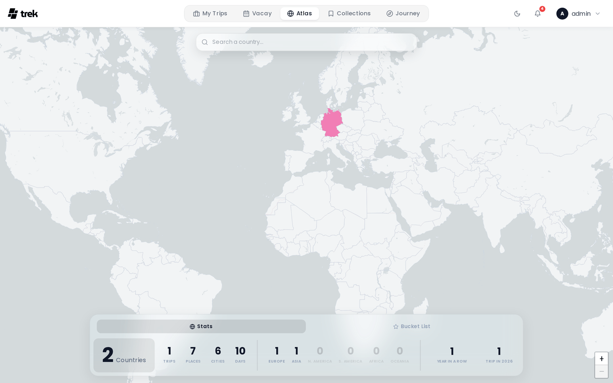

# Atlas

Atlas is an interactive world map that shows countries and regions you have visited across all your trips, together with a bucket list of places you want to go.

> **Admin:** enable Atlas in [Admin-Addons](Admin-Addons).

## What Atlas is

Atlas gives you a visual overview of your travel footprint. Visited countries are highlighted on the map. You can also mark individual sub-national regions and maintain a personal bucket list of future destinations.

## Accessing Atlas

When the admin has enabled the Atlas addon, an **Atlas** entry appears in the main navigation. Your visited countries are populated automatically from your existing trips.

## Marking countries as visited

Click any country on the map to open an action popup where you can mark it as visited or add it to your bucket list. Use the search bar at the top of the map to find and fly to a country — pressing Enter or selecting a result from the dropdown opens the same action popup.

To remove a manually-marked country (one with no trips or places recorded in it), click it on the map and confirm removal in the popup.

Visits detected automatically from your trips are shown in addition to any countries you mark manually.

### Sub-national regions

At zoom level 5 and above, the map switches to a sub-national region view (states, provinces, etc.). You can mark individual regions as visited or add them to your bucket list. Marking a region also counts the parent country as visited if it was not already.

## Bucket list

The bucket list is separate from "visited". Use it to track countries or places you want to visit in the future. Each bucket list item can have a name, coordinates, country code, optional notes, and a target date.

## Statistics

Your Atlas statistics panel shows:

- **Countries visited** — total number of distinct countries.
- **Trips** — total number of trips across all time.
- **Places** — total number of individual places logged in trips.
- **Cities** — total number of distinct cities visited.
- **Travel days** — total days spent travelling.
- **Continent breakdown** — number of countries visited per continent (Europe, Asia, North America, South America, Africa, Oceania).
- **Travel streak** — number of consecutive years in which you have taken at least one trip.
- **Trips this year** — number of trips in the current calendar year.

## Visual effect

The desktop glass panel at the bottom of the map uses a liquid-glass visual effect — a dynamic inner glow and border highlight that follows your cursor across the panel.

## Plugin country layers

Installed plugins can tint countries on the Atlas map with their own layers — for example wishlists or travel advisories. A plugin implements the `atlasLayerProvider` hook and returns one or more layers, each a set of ISO country codes with a tone; TREK validates the codes and tints them itself. Layers are per-user and additive: a plugin never touches the map canvas, and one that errors or is slow contributes nothing.

> **Plugins:** requires the `hook:atlas-layer-provider` permission. See [Plugin-Development](Plugin-Development) for the hook contract.

## See also

- [Addons-Overview](Addons-Overview)
- [Admin-Addons](Admin-Addons)
