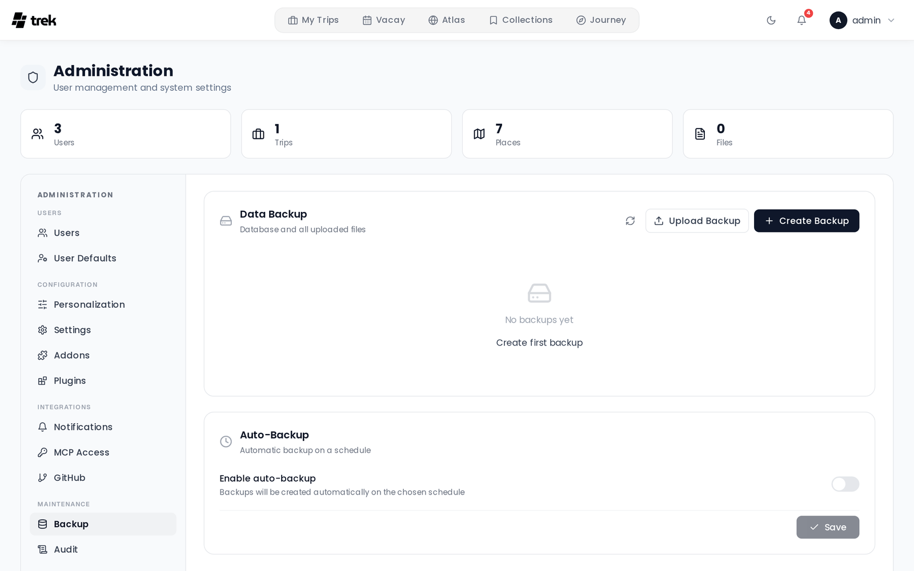

# Backups

TREK stores all data in a single SQLite database (`travel.db`) plus an `uploads/` directory of attachments, cover photos, and avatars. The Backup panel lets you create, download, restore, and schedule backups of both.

## Where to find it

**Admin Panel → Backup** tab.

<!-- TODO: screenshot: backup tab with backup list and auto-backup settings -->

## What a backup contains

A backup is a ZIP archive with these entries:

| Entry | Contents |
|---|---|
| `travel.db` | The full SQLite database |
| `uploads/` | All uploaded attachments, covers, and avatars |
| `plugins-data/` | Each installed plugin's own database + files (present only if plugins are installed) |
| `plugins-code/` | The installed plugin code, so a restore is self-contained (dev-linked plugins are skipped) |

**Not included:** the encryption key. Store your `ENCRYPTION_KEY` separately from the backup ZIP — for example, in a password manager. See [Encryption-Key-Rotation](Encryption-Key-Rotation).

## Manual backup

Click **Create Backup** in the Backup tab. The server creates the ZIP and makes it available for download. Up to 3 manual backups can be created per hour per IP address (rate-limit window: 1 hour).

You can also download or delete any existing backup from the list.

## Restoring a backup

You can restore from:

- **A stored backup** — click **Restore** next to any backup in the list.
- **An uploaded ZIP** — click **Upload & Restore** and select a backup file from your computer (maximum upload size: 500 MB by default, configurable with the `BACKUP_UPLOAD_LIMIT_MB` environment variable — see [Environment-Variables](Environment-Variables)).

Before restoring, TREK runs integrity checks on the uploaded database:

1. **SQLite `PRAGMA integrity_check`** — verifies the database file is not corrupt.
2. **Required tables present** — confirms the file contains `users`, `trips`, `trip_members`, `places`, and `days`. Files missing any of these are rejected as not being a valid TREK backup.

> **Warning:** Restoring replaces all current data. Back up your current state first if you want to keep it.

> **Plugins & restart:** `travel.db` and `uploads/` are swapped in immediately. Plugin data and code are **staged** and applied on the **next server restart** — the running plugins hold their databases open, so they can't be swapped live (the same reason the bundled encryption key only takes effect on restart). Restart the server after restoring an instance that uses plugins.

## Auto-backup

Enable scheduled backups in the **Auto-Backup** section of the Backup tab.

**Interval** options:

- Hourly
- Daily
- Weekly
- Monthly

**Retention** (`Keep last … days`) — enter a number of days. Backups older than that many days are pruned after each auto-backup run. Set to **0** to keep all backups indefinitely (no pruning).

**Schedule** options (depend on interval):

- **Hour** — time of day for daily, weekly, and monthly backups (0–23).
- **Day of week** — Sunday through Saturday (for weekly backups).
- **Day of month** — 1–28 (for monthly backups). Day 29–31 is excluded to avoid months with fewer days.

Auto-backup files are named `auto-backup-<timestamp>.zip` (manual backups use `backup-<timestamp>.zip`).

After each auto-backup run, **all** backup files (manual and auto) older than `keep_days` are pruned. Set `keep_days` to `0` to disable pruning entirely.

## Before updating TREK

Always create a manual backup before updating. See [Updating](Updating).

## Audit log

The following actions are recorded in the [Audit-Log](Audit-Log):

| Action key | When |
|---|---|
| `backup.create` | Manual backup created |
| `backup.restore` | Restore from stored backup |
| `backup.upload_restore` | Restore from uploaded ZIP |
| `backup.delete` | Backup deleted |
| `backup.auto_settings` | Auto-backup settings saved |

## See also

- [Encryption-Key-Rotation](Encryption-Key-Rotation)
- [Admin-Panel-Overview](Admin-Panel-Overview)
- [Security-Hardening](Security-Hardening)
- [Updating](Updating)
