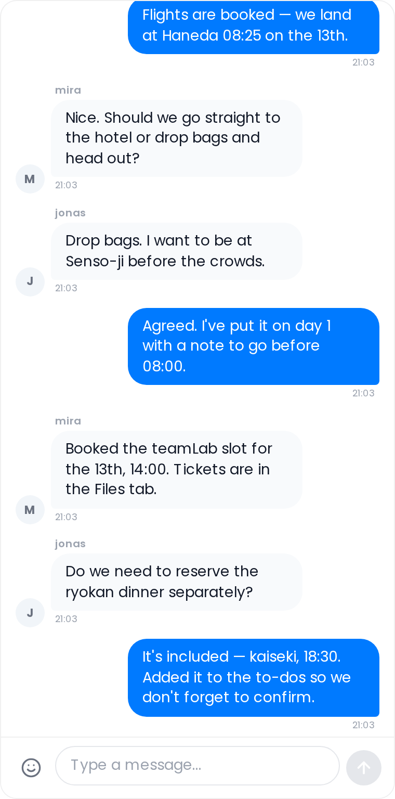

# Collab Chat

Chat with your group in real time, without leaving the trip planner.

## Where to find it

Open the trip planner and select the **Collab** tab. If the Chat sub-feature is enabled, a Chat panel appears — on desktop as the left column, on mobile as the first tab in the tab bar.

The Collab addon must be enabled by an admin and the Chat sub-feature must be turned on. See [Real-Time-Collaboration](Real-Time-Collaboration).

## Sending messages

Type in the input field at the bottom and press **Enter** (or click the send button) to post. Hold **Shift + Enter** to insert a line break without sending.

Messages load in pages of 100. A **Load more** button appears at the top of the chat when older messages are available.

## Emoji

Click the smiley-face button in the composer to open the emoji picker. The picker has three categories:

- **Smileys** — facial expressions and gestures
- **Reactions** — hearts, fire, thumbs, and similar
- **Travel** — planes, maps, food, cameras, and destinations

Emoji are rendered via Twemoji for consistent appearance across platforms.

## Reactions

**Right-click** a message on desktop (or **double-tap** on mobile) to open the quick-reaction menu. Eight quick reactions are available: ❤️ 😂 👍 😮 😢 🔥 👏 🎉. Click any reaction to toggle it on or off. Reactions from all users aggregate beneath the message; hover a reaction badge to see who reacted.

## Replies

Hover a message to reveal the action buttons. Click **Reply** to quote that message. A preview of the quoted text appears above your new message in the composer; click the **×** to cancel the reply. The quoted text is displayed inline inside your bubble when sent.

## URL link previews

When a message contains a URL, TREK automatically fetches an Open Graph preview (title, description, and thumbnail image) and displays it below the message text. Only the first URL in a message generates a preview.

## Message styling

Your own messages appear **right-aligned** with a blue bubble. Other members' messages appear **left-aligned** with a gray bubble. The username is shown above the first message in a group of consecutive messages from the same person; the avatar is shown beside the **last** message in that group. Timestamps appear below the last message in each group.

Messages that consist of only 1–3 emoji are displayed larger without a bubble.

## Deleting messages

Hover your own message to reveal the delete button (trash icon). The delete button is only visible when you have the `collab_edit` permission. Deleting replaces the bubble with an italicised notice — showing your username, "deleted a message", and a timestamp — visible to all members.

## Read-only viewers

Users without the `collab_edit` permission can read all messages but the composer is disabled — they cannot send, react, or delete messages. The reply button is visible to all users, but completing a reply still requires `collab_edit` (the send button is hidden for read-only users).

## Related pages

[Real-Time-Collaboration](Real-Time-Collaboration) · [Collab-Notes](Collab-Notes) · [Collab-Polls](Collab-Polls)
