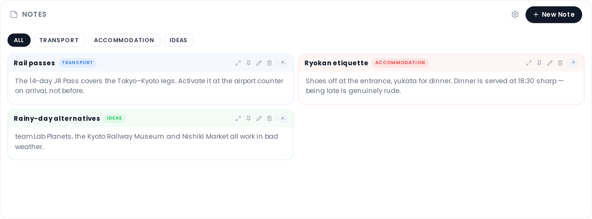

# Collab Notes

Share structured, richly formatted notes with your group. Notes are organized into color-coded categories and can be pinned, attached with files, and linked to external websites.

## Where to find it

Open the trip planner → **Collab** tab → **Notes** section. The Collab addon must be enabled and the Notes sub-feature must be turned on. See [Real-Time-Collaboration](Real-Time-Collaboration).

## Categories

Notes are grouped into categories. Each category has a name and a color chosen from six swatches: **Indigo**, **Red**, **Amber**, **Emerald**, **Blue**, and **Violet**.

To manage categories, click the settings (gear) icon in the Notes header (only visible to users with the `collab_edit` permission). From the category settings modal you can:

- Add a new category (type a name and click **+**)
- Rename a category by clicking its name inline
- Change a category's color by clicking a swatch
- Delete a category

All changes (including color updates) are staged locally and applied only when you click **Save** in the modal. Saving a color change updates every note in that category.

## Creating a note

Click **+ New Note** in the Notes header (only visible to users with the `collab_edit` permission). A modal opens with the following fields:

| Field | Required | Notes |
|-------|----------|-------|
| Title | Yes | Plain text |
| Body | No | Markdown |
| Category | No | Select from existing categories |
| Website | No | URL; shows an Open Graph thumbnail on the note card |
| Attachments | No | Files up to 50 MB; see restrictions below |

Click **Create** to save.

## Markdown support

Note bodies are rendered as GitHub Flavored Markdown with soft line breaks. Supported syntax includes headings, bold/italic, links, ordered and unordered lists, task lists, tables, fenced code blocks, and blockquotes.

## Pinning

Click the pin icon on a note card to pin it. Pinned notes sort to the top of the list (above all unpinned notes, regardless of category). Click again (shown as the unpin icon) to unpin.

## Attachments

You can attach images, PDFs, and other files to a note (requires the `file_upload` permission). Maximum file size is **50 MB** per file.

The following file types are blocked: `.svg`, `.html`, `.htm`, `.xml`, `.xhtml`, `.js`, `.jsx`, `.ts`, `.exe`, `.bat`, `.sh`, `.cmd`, `.msi`, `.dll`, `.com`, `.vbs`, `.ps1`, `.php`.

Image thumbnails are shown on the note card. Click a thumbnail to open a lightbox. PDFs open in a document viewer overlay.

You can also paste images or PDFs directly into the create/edit form (if the `file_upload` permission is granted).

## Editing a note

Click the pencil icon on a note card to open the edit modal. All fields, including attachments, can be updated. To remove an existing attachment, click the **×** next to it in the edit form.

## Expanding a note

Click the expand icon (arrows) on a note card to open a full-content view in a portal overlay. Users with the `collab_edit` permission will see a pencil button in the overlay header to switch directly to the edit modal.

## Filtering

Use the category filter pills below the Notes header to show only notes belonging to a specific category. Click **All** to clear the filter.

## Related pages

[Real-Time-Collaboration](Real-Time-Collaboration) · [Collab-Chat](Collab-Chat) · [Collab-Polls](Collab-Polls)
