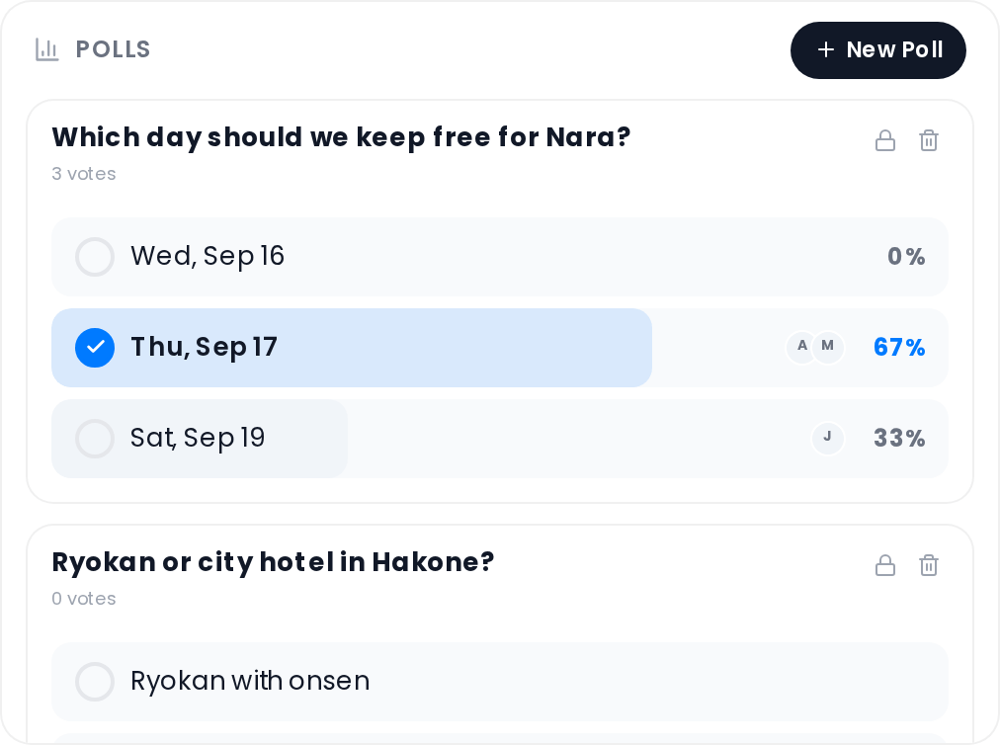

# Collab Polls

Create group polls to make decisions collaboratively — where to eat, which hotel, what to do on a free day.

## Where to find it

Open the trip planner → **Collab** tab → **Polls** section. The Collab addon must be enabled and the Polls sub-feature must be turned on. See [Real-Time-Collaboration](Real-Time-Collaboration).

## Creating a poll

Users with `collab_edit` permission can click **+ New** in the Polls header. A modal opens with the following fields:

| Field | Required | Notes |
|-------|----------|-------|
| Question | Yes | The poll prompt |
| Options | Yes | At least 2 options required; add more with **+ Add option** |
| Multiple choice | No | Toggle on to allow voters to select more than one option |

Click **Create** to save and broadcast the poll to all connected members.

## Voting

Click an option button to vote. A filled circle and blue highlight indicate your selection. For **multiple-choice** polls, you can click additional options to select more than one; clicking an already-selected option removes your vote for that option. For **single-choice** polls, clicking a different option moves your vote to the new selection.

Percentage bars and voter avatars are only visible **after you have voted** or once the poll is closed or expired.

## Results

Each option shows:

- A **percentage fill bar** that expands proportionally to the votes received
- Up to **3 voter avatar chips** stacked next to the option
- The **percentage** of total votes in the right margin

The option with the most votes is highlighted when the poll is closed or expired.

## Deadline

Polls may have an optional deadline set via the API. When a deadline is present, a live countdown badge appears on the poll card, updating every **30 seconds**. The badge shows the remaining time in days/hours/minutes format.

When the deadline passes, the poll is automatically treated as closed: voting is disabled and results are displayed to everyone.

## Closing a poll manually

Users with `collab_edit` permission can click the lock icon on an open poll to close it immediately. Once closed, voting is permanently disabled.

## Deleting a poll

Users with `collab_edit` permission can delete a poll using the trash icon. Deletion is permanent and removes the poll for all members.

## Active and closed sections

Open polls appear at the top of the list. Closed or expired polls move to a **Closed** section below the active polls.

## Related pages

[Real-Time-Collaboration](Real-Time-Collaboration) · [Collab-Chat](Collab-Chat) · [Collab-Notes](Collab-Notes)
