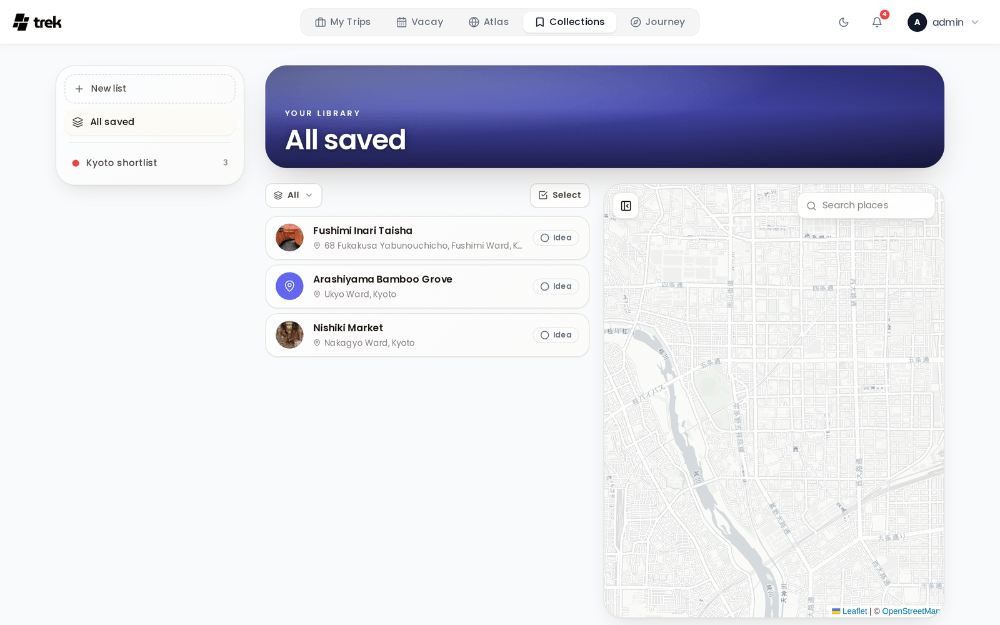
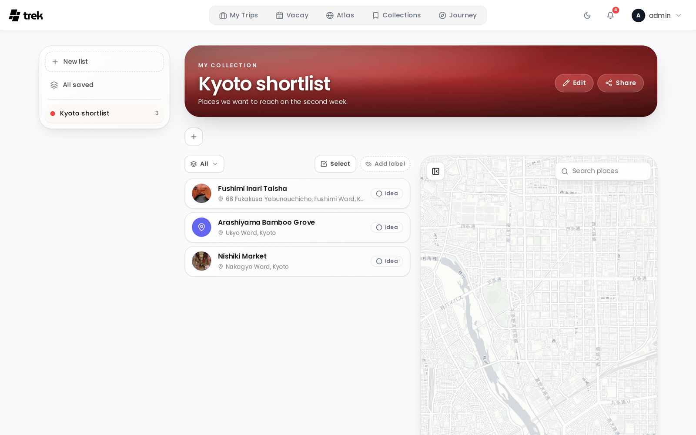

# Collections

Collections is a personal, server-wide library of saved places that lives outside of any single trip. Keep multiple named lists of places you have discovered — a "Norway road trip" wishlist, "Best coffee in Lisbon", "Someday" — each with a want-to-go / visited status, and share a list with other users.

> **Admin:** enable Collections in [Admin-Addons](Admin-Addons).

## What Collections is

A place you save to a trip only exists inside that trip. Collections is the opposite: a place library that belongs to *you*, independent of any trip, so a spot you find while planning one trip is still there for the next one. Places are copied into and out of trips (never linked), so editing a saved place never changes a trip and vice versa.

## Accessing Collections

When the admin has enabled the addon, a **Collections** entry appears in the main navigation (and a bottom-tab on mobile). Opening it shows your lists on the left, the active list's places in the middle, and a map on the right.

The dashboard also gains a **Collections widget** that surfaces your lists as compact badges. Each user can hide that widget from their own dashboard under [Display Settings](Display-Settings) without affecting anyone else.

## Lists

- **Create a list** from the "New list" action in the rail. A list has a name, a colour, an optional cover image (upload your own or search Unsplash), a description and a set of links.
- **Edit or delete a list** from the **Edit** button in the list's hero (owner only). Deleting a list removes its saved places.
- **All saved** is a built-in view that unions the places from every list you own or co-own, so you can search and act across your whole library at once.

## Place status

Every saved place carries a status you can cycle with one tap:

- **Idea** — something you noted but haven't committed to.
- **Want to go** — on the shortlist.
- **Visited** — been there.

Status is a Collections concept and is not carried into a trip when you copy a place.

## Categories

Places can be assigned a **category** from the same admin-defined set used across TREK (see [Admin: Categories](Admin-Categories)). Category colours and icons show on the place avatar, the place detail and the list rows, and you can filter a list by category.

## Adding places

- **Search and add** — the "+" action opens a search; pick a result and set the name, category, status, a markdown description and links before saving, all in one step.
- **Save from a trip** — the place inspector and the trip place context menu both offer **Save to collection**, which toggles that place in or out of each of your lists.
- **Bulk-add from a trip** — in the trip place list, enter select mode, tick several places, and use the **Save to collection** action in the selection bar to copy them all into a chosen list at once. Duplicates (by name or coordinates) are skipped automatically.

## Place detail

Clicking a saved place opens a detail sheet showing a cover photo (fetched automatically when the place has none of its own), its category, its [labels](#custom-labels), a live status control, a markdown description, and links. Editing the place also lets you assign its labels. From there you can edit the place, **copy it into a trip**, or remove it from the list.

## Filtering and bulk actions

Above the places sit compact filters — by **status**, by **category**, and by [**label**](#custom-labels) — plus a **Select** toggle. In select mode you can:

- **Select all** the currently filtered places.
- **Assign label** — add one or more of the list's labels to every selected place at once.
- **Copy to trip** — copies the selected places into any of your trips (carrying their name, description, category, notes, price, coordinates, photo and tags).
- **Move** or **Duplicate** the selection into another of your lists.
- **Delete** the selection.

## Custom labels

Each list can define its own **labels** — for example *Berlin*, *Hamburg* and *Ostsee* inside a "Germany 2026" list — to group its saved places beyond the shared category set. Labels belong to the one list they're created in and are shared with everyone on it.

- **Manage** — a label manager (reachable from the filter bar) lets you create, rename, recolour and delete labels.
- **Assign** — set a place's labels from its detail sheet, or add labels to many places at once with **Assign label** in the selection bar.
- **Filter** — pick one or more labels in the filter bar to narrow **both the place list and the map** to places carrying any of them.

Managing and assigning labels needs edit rights (Editor or Admin); **filtering by label is available to every member, including Viewers**. Moving a place to another list drops its labels, since labels belong to the source list.

## Sharing a list (fusion)

Lists are private by default. The owner can **share** a list by inviting other users, similar to Vacay fusion. Invited users see the list once they accept, and changes sync live over websocket.

### Member roles

When sharing, the owner assigns each member a permission role, and can change it at any time:

| Role | Can do |
|---|---|
| **Viewer** | View the list and copy its places into their own trips, and filter by label — no changes to the list. |
| **Editor** *(default)* | Add new places and edit existing ones, and manage + assign the list's labels. |
| **Admin** | Everything an editor can, plus delete places. |

The owner always has full control. The owner can also remove a member, and a member can leave a shared list themselves. Permissions are enforced on the server, so a role can only ever do what it is allowed to.

## See also

- [Addons-Overview](Addons-Overview)
- [Admin-Addons](Admin-Addons)
- [Admin: Categories](Admin-Categories)
- [Dashboard Widgets](Dashboard-Widgets)
