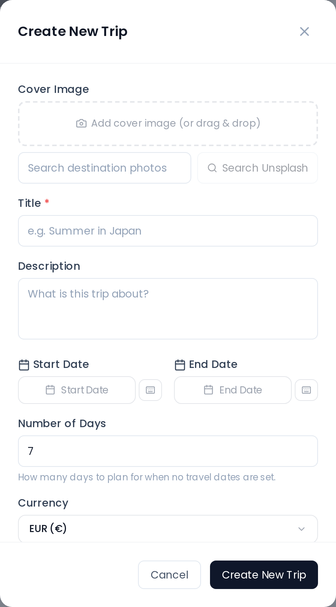

# Creating a Trip

## Opening the Dialog

Click the **New Trip** button in the dashboard toolbar (or the **Create First Trip** button on the empty state) to open the Create Trip dialog.

You can also open it directly via a deep link: navigate to `/dashboard?create=1`. This is the URL used by system notices that prompt you to create a trip.

## Fields

### Title (required)

The trip name. Cannot be empty — saving is blocked until a title is entered.

### Description (optional)

A short free-text description shown on the trip card.

### Dates

Set a **Start date** and **End date** using the date picker. The day count is calculated automatically when both are set.

If you leave **both** dates empty, a separate **Day count** field appears. Enter a number between **1 and 365** to create a date-less itinerary with a fixed number of days.

You cannot set only one date and leave the other blank via normal interaction — setting a start date auto-fills or adjusts the end date to preserve the previous duration.

### Currency

The trip's currency — its **accounting base**. Every expense in the Costs tab is converted into it, and every balance and settle-up suggestion is calculated in it. Defaults to **EUR**; 165 currencies are available.

Pick the currency you will actually settle up in. It is not a cosmetic label, but it is not a one-way door either: you can change it later from the same dialog (with the `trip_edit` permission), and TREK re-bases the existing expenses so no money moves — see [Currencies → Changing the trip currency](Currencies#changing-the-trip-currency).

> This is **not** the same as the display currency in Settings → General, which only changes what *you* read. See [Currencies](Currencies).

### Cover Image

The cover image is displayed on the trip card and as the background of the Spotlight card. You can add one in three ways:

- **Drag and drop** an image file onto the dashed upload area.
- **Paste from clipboard** — if you have an image in your clipboard, paste it anywhere in the dialog.
- **File picker** — click the upload area to browse for a file.
- **Search Unsplash** — type a query to pick a stock photo. If this returns *"Unsplash search unavailable"* (common on VPS/datacenter IPs), configure a free Unsplash Access Key — see [Environment-Variables → Image Search (Unsplash)](Environment-Variables#image-search-unsplash).

When **creating** a new trip the cover image field is always visible. When **editing** an existing trip it is only shown if you have the `trip_cover_upload` permission. For a new trip, the image is uploaded immediately after the trip is created.

### Reminder

A push notification sent before the trip departs. The field shows a set of preset options:

| Option | Days before departure |
|---|---|
| None | 0 |
| 1 day | 1 |
| 3 days | 3 |
| 9 days | 9 |
| Custom | 1–30 (you enter the number) |

When **creating** a new trip the reminder field is always visible. When **editing** an existing trip it is only shown to the **trip owner** or **admin** users.

If reminders are disabled on your instance (`trip_reminders_enabled = false`), the reminder section is shown at reduced opacity with an informational message in place of the preset buttons.

> **Admin:** Trip reminders are controlled by a server-side feature flag (`trip_reminders_enabled`). Contact your administrator to enable them.

### Members

Add initial trip members from the members selector. On a **new** trip, selected members are queued locally and added to the trip immediately after it is saved. The selector shows all registered users on your instance except yourself.

## Saving

Click **Create Trip**. The trip is saved and you are taken to the [Trip-Planner-Overview](Trip-Planner-Overview) for the new trip.

## Related Pages

- [Trip-Members-and-Sharing](Trip-Members-and-Sharing)
- [Trip-Planner-Overview](Trip-Planner-Overview)
- [My-Trips-Dashboard](My-Trips-Dashboard)
