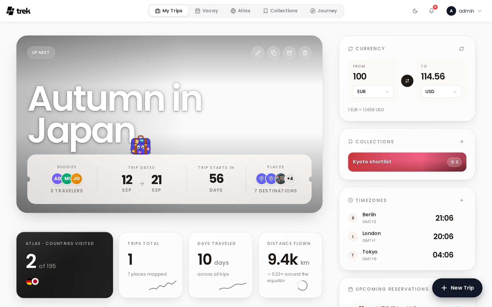

# Dashboard Widgets

The My Trips dashboard includes two utility widgets: a currency converter and a timezone clock.

## Where they appear

On large screens (desktop/wide tablet), both widgets appear in a sticky right-hand sidebar of the [My-Trips-Dashboard](My-Trips-Dashboard). On mobile and narrow screens, the widgets are accessible via **Quick Actions** buttons on the dashboard — tapping the Currency or Timezone button opens a bottom sheet containing the full widget.

Each user configures their own widgets independently. Whether each widget is shown or hidden is saved to your account on the server (synced across devices). The selected currency pair and saved timezone list are stored in your browser's local storage and are device-specific.

### Showing and hiding widgets

On desktop, click the **Settings (gear) icon** in the dashboard toolbar to reveal toggle switches for each widget. Turning a widget off removes it from the sidebar; the preference is saved to your account.

---

## Currency Converter

The currency converter lets you quickly convert an amount between two currencies.

**How to use:**

1. Enter an amount in the input field.
2. Select a source currency from the left selector.
3. Select a target currency from the right selector.
4. The converted amount is displayed immediately below.

You can also click the swap arrow to reverse source and target.

**Exchange rates** are fetched from [Frankfurter](https://frankfurter.dev) using the `https://api.frankfurter.dev/v2/rates?base={from}` endpoint. Rates are refreshed each time you change a currency or click the refresh icon.

**Supported currencies:** 162 currencies are available in the selector, including all major fiat currencies (USD, EUR, GBP, JPY, etc.) and many minor ones.

---

## Timezone Clock

The timezone clock displays live clocks for multiple time zones simultaneously.

**How to use:**

- Your local time is always shown at the top.
- Below it, any zones you have added are listed with their current time and offset relative to your local zone.
- Click **+** to add a zone. You can pick from 18 preset city zones, or enter any IANA timezone identifier (e.g. `America/Denver`) with an optional custom label (if omitted, the city portion of the identifier is used as the label).
- Hover over a zone row and click **×** to remove it.

**Preset zones (18):**

New York, London, Berlin, Paris, Dubai, Mumbai, Bangkok, Tokyo, Sydney, Los Angeles, Chicago, São Paulo, Istanbul, Singapore, Hong Kong, Seoul, Moscow, Cairo.

Clocks update every 10 seconds. The 12-hour or 24-hour format follows your display settings (see [Display-Settings](Display-Settings)).

---

## See also

- [My-Trips-Dashboard](My-Trips-Dashboard)
- [Addons-Overview](Addons-Overview)
