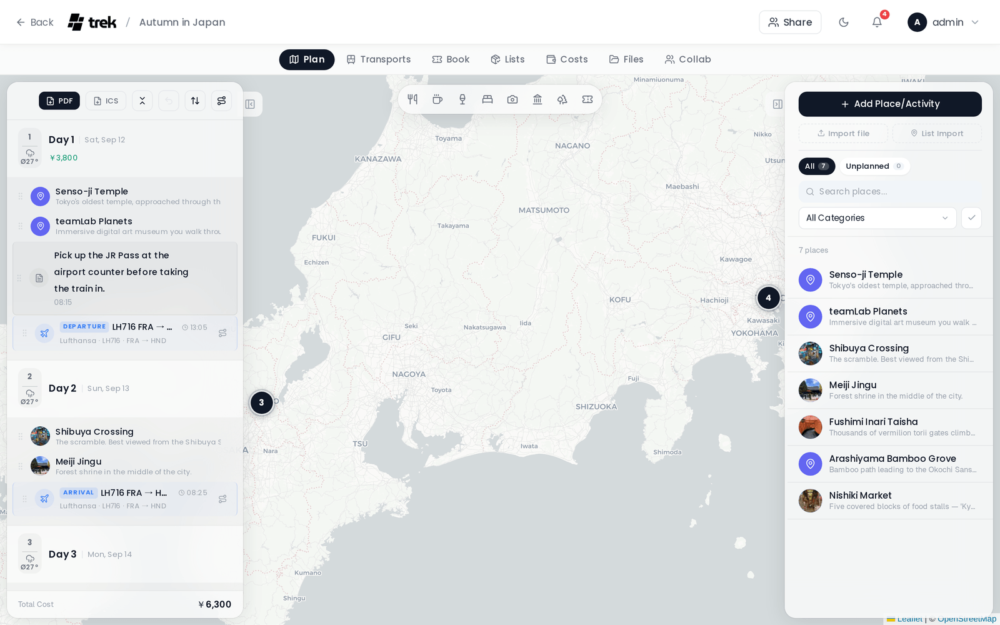

# Day Plans and Notes

The Day Plan sidebar lets you organize places into days, add free-form notes, and manage the order of your itinerary.

## The Day Plan sidebar

The Day Plan sidebar is the left panel in the trip planner. Each trip day is shown as a collapsible section. Expanded or collapsed state is saved per trip in `sessionStorage` (key: `day-expanded-{tripId}`), so your layout is preserved across page reloads in the same browser session.

## Day timeline

Each day shows a merged, time-ordered list of:

- **Assigned places** — with time, category icon, and action buttons
- **Day notes** — with their selected icon and optional time
- **Reservations and transports** — non-hotel types (flights, trains, cars, cruises) appear inline; hotels appear in the Day Detail panel

Items are sorted by their time or position index.

## Assigning places to a day

- **Drag and drop** — drag a place from the right-hand Places sidebar and drop it onto a day section or between existing items.

- **Add button** — Click on the day and then click the **+** button inside an expanded day section to open an inline search panel; find the place and tap it to assign.

- **Mobile** — tap the **Add Place** button inside an expanded day section to open an inline search panel; find the place and tap it to assign.

You can also reorder places within a day, or move them to a different day, by dragging and dropping inside the sidebar.

To remove a place from a day, click the **X** button next to the place in the day timeline.

## Multi-day reservations

A reservation that spans multiple days appears in each relevant day with a phase label:

| Reservation type | Start day | Middle days | End day |
|---|---|---|---|
| Flight | Departure | In transit | Arrival |
| Car | Pickup | Active | Return |
| Other | Start | Ongoing | End |

Car rentals that are in the "Active" (middle) phase are shown in the day header rather than the timeline.

## Day notes

Click the note **+** button in any day section to add a note. Notes have three fields:

- **Title** (required) — the main note text shown in the timeline
- **Subtitle / detail** (optional) — a free-form text field (Markdown supported) displayed beneath the title
- **Icon** — choose from 20 icons: FileText, Info, Clock, MapPin, Navigation, Train, Plane, Bus, Car, Ship, Coffee, Ticket, Star, Heart, Camera, Flag, Lightbulb, AlertTriangle, ShoppingBag, Bookmark

Notes interleave with places and transports in the day timeline and are ordered by their `sort_order`. Use the **↑ / ↓** chevron buttons on a note to reposition it within the merged timeline. Notes can also be repositioned by dragging.

## Day Detail panel

Click a day header to open the Day Detail panel. It appears as a floating panel centered in the map area and shows:

- The weather forecast for that day (see [Weather-Forecasts](Weather-Forecasts))
- Reservations linked to assignments on that day
- Accommodation block (hotel check-in / check-out, with check-in window and confirmation number)

The panel can be collapsed to a slim header bar or closed entirely with the **X** button.

## Toolbar actions

At the top of the Day Plan sidebar:

- **Export PDF** — downloads a PDF of the full trip plan. See [PDF-Export](PDF-Export).
- **ICS** — exports the trip as a calendar file (.ics) for import into calendar apps.
- **Expand / Collapse all** — toggles all day sections open or closed at once.
- **Undo** — reverses the last drag, reorder, or assign action.

Route controls (optimize order, open in Google Maps) appear inside each expanded day section after the place list.

**See also:** [Places-and-Search](Places-and-Search) · [Map-Features](Map-Features) · [Route-Optimization](Route-Optimization) · [Weather-Forecasts](Weather-Forecasts) · [Reservations-and-Bookings](Reservations-and-Bookings)