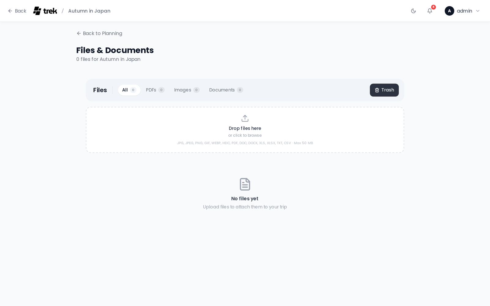

# Documents and Files

Attach and manage documents, tickets, and other files for your trip.

## Where to find it

Open the **Files** tab inside the trip planner, or navigate directly to `/trips/:id/files`.

> **Admin:** Files is an addon. Enable it in [Admin-Addons](Admin-Addons).

## Uploading

Drag and drop files onto the upload area, click it to open the file picker, or paste an image directly into the Files panel.

- **Maximum file size:** 50 MB per file.
- **Blocked file types:** `.svg`, `.html`, `.htm`, `.xml` — these are always rejected.
- **Default allowed types:** jpg, jpeg, png, gif, webp, heic, pdf, doc, docx, xls, xlsx, txt, csv, pkpass. An admin can customize the allowed list in [Admin-Addons](Admin-Addons).

Requires the `file_upload` permission.

## Browsing and filtering

The toolbar provides filter tabs: **All**, **PDF**, **Images**, **Docs**, and conditionally **Starred** (only shown when at least one file is starred) and **Collab** (only shown when files exist from collaborative notes). Each tab shows a count badge.

## Previewing files

Clicking a non-image file (e.g., PDF) opens an inline preview modal with options to open in a new tab or download. Clicking an image file opens a full-screen lightbox. You can:

- Navigate between images using the **arrow buttons** or the **left/right arrow keys**.
- Swipe left/right on touch devices.
- Jump to a specific image using the **thumbnail strip** at the bottom.
- Download or open the image in a new tab from the lightbox header.

## Starring

Click the **star icon** on any file to favorite it. Starred files sort to the top of the list and can be filtered with the Starred tab.

Requires the `file_edit` permission.

## Trash

Deleting a file moves it to the trash. Switch to the trash view using the **Trash** button in the toolbar. From the trash view you can:

- **Restore** a file to make it active again.
- **Permanently delete** a single file.
- **Empty trash** to permanently remove all trashed files at once.

Restore and delete operations require the `file_delete` permission.

## Linking files to places, reservations, or assignments

A file can be attached to multiple places and reservations at the same time (many-to-many). From the file manager, click the **link (pencil) icon** on a file to open the assign modal. From there you can toggle links to any trip place or reservation. You can also add a descriptive note to the file in the same modal.

From a reservation modal, use the "link existing file" picker to attach files directly.

## Downloading

Click the download icon on any file row to download it. `.pkpass` files (Apple Wallet passes) are served with the `application/vnd.apple.pkpass` MIME type, so Safari on iOS and macOS offers to add the pass to Wallet instead of saving it as a generic download.

## Permissions

| Permission | Controls |
|---|---|
| `file_upload` | Uploading new files. |
| `file_edit` | Starring and linking files. |
| `file_delete` | Moving to trash, restoring, and permanently deleting. |

## See also

- [Reservations-and-Bookings](Reservations-and-Bookings)
- [Admin-Addons](Admin-Addons)
- [Trip-Planner-Overview](Trip-Planner-Overview)
