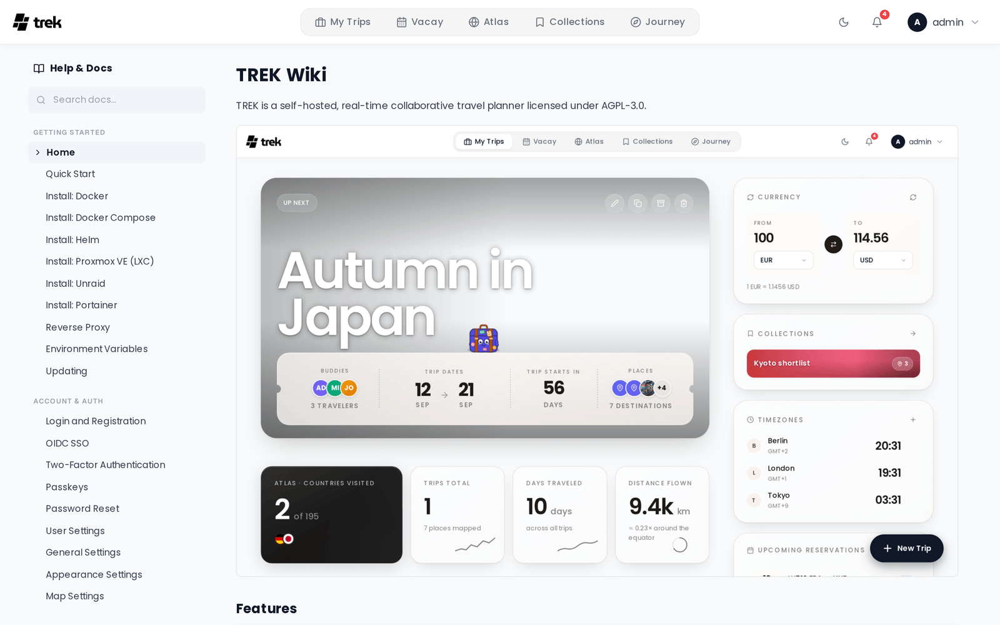

# In-App Help

Read the whole TREK wiki from inside TREK, without leaving the app or opening GitHub.

## Where to find it

Click your avatar in the top-right navbar and choose **Help**, or go to `/help` directly. Individual pages live at `/help/{slug}` — for example `/help/Packing-Lists`.

The page is titled **Help & Docs**. You must be signed in to reach the route.

## The docs ship with your install

Since **v3.4.0** the wiki is bundled into the TREK image and served from disk (commit `6c87bf2f`). That means:

- The help you read always matches the version you are running. A v3.4 install shows v3.4 docs, not whatever `main` says.
- Help works with no outbound network access at all.
- Screenshots and other images are served by TREK, not fetched from GitHub — your browser never talks to github.com for help content.

### The GitHub fallback

If the bundled `wiki/` directory cannot be found — an unusual layout, or an image built without it — TREK logs a warning and falls back to fetching the public GitHub wiki over the network instead, caching each page and image for an hour and serving a stale copy rather than failing outright. Help degrades instead of disappearing, but the content then tracks the latest release rather than your version.

TREK probes for `_Sidebar.md` specifically, not just the directory, so a half-copied `wiki/` folder falls back rather than serving an empty table of contents.

### `TREK_WIKI_DIR`

The bundled directory is found automatically. `TREK_WIKI_DIR` overrides where TREK looks — an escape hatch for unusual layouts, not something a normal install needs to set. See [Environment-Variables](Environment-Variables).

## The sidebar

The left sidebar mirrors this wiki's own table of contents, parsed straight out of `_Sidebar.md`: the same sections, in the same order, with the same page titles. On screens narrower than desktop the sidebar collapses behind a **Contents** button that opens it as a drawer.

The page you are reading is highlighted with a chevron.

## Search

The **Search docs…** box at the top of the sidebar filters the navigation as you type. It matches **page titles only** — it does not search inside page text. Sections with no matching page disappear; when nothing matches you get **No matching pages.**

To search page contents, use the wiki on GitHub or your browser's in-page find.

## Rendering

Pages render with TREK's own styling: headings, tables, code blocks, blockquotes, and images. A few things are handled specially so the same Markdown works both here and on GitHub:

- Wiki links in either GitHub spelling — `[[Title|Slug]]` and the bare relative `[Currencies](Currencies)` — become in-app links that navigate without a page reload.
- Relative image paths are rewritten to TREK's own asset endpoint.
- Heading anchors use GitHub's slug scheme, so a `](#some-heading)` link inside a page lands in the right place.
- HTML comments (such as `<!-- TODO: screenshot -->` placeholders) are stripped rather than shown.

External links open in a new tab.

If a page cannot be loaded you get **Couldn't load this page** — *The help content is fetched from the TREK wiki. Check your connection and try again.*

## Permissions

No permission gates the help browser; any signed-in user sees the same pages. The underlying `/api/help` endpoints are unauthenticated, because the content is public documentation — that is also what lets image tags load without sending credentials.

## See also

- [FAQ](FAQ)
- [Troubleshooting](Troubleshooting)
- [Environment-Variables](Environment-Variables)
- [Updating](Updating)
- [Contributing](Contributing)
