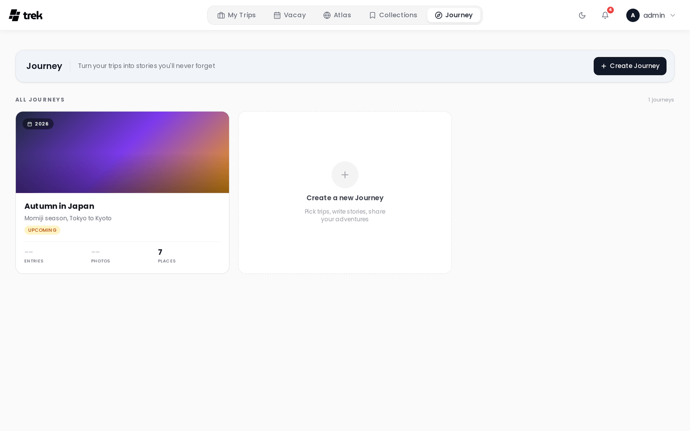

# Journey Journal

Journey is a photo-first travel journal. Each journey is linked to one or more of your trips and contains per-day entries with text, photos, mood, and weather.

> **Admin:** enable Journey in [Admin-Addons](Admin-Addons).

<!-- TODO: screenshot: journal entries view with photos and mood indicators -->

## What Journey is

Journey lets you write a narrative account of your travels alongside your trip plan. Entries are tied to specific days and can include prose, photos, a mood rating, weather conditions, and verdict cards. Completed journeys can be shared publicly with a read-only link.

## Accessing Journey

When the admin has enabled the Journey addon, a **Journey** entry appears in the main navigation. The Journey list page shows all your journals as cards with cover images, entry counts, photo counts, and place counts.

## Creating a journey

From the Journey list, click **Create journey**. Give it a title and optional subtitle, then select one or more existing trips to link. Linking a trip imports the trip's places as location anchors for your entries. You can link additional trips later from the journal settings.

## Journal entries

Each entry corresponds to a day in your journey. The entry editor provides:

- **Title** — a short heading for the day.
- **Story** — free-form text that supports Markdown formatting.
- **Mood** — choose one of four values:

  | ID | Label | Color |
  |---|---|---|
  | `amazing` | Amazing | Pink |
  | `good` | Good | Amber |
  | `neutral` | Neutral | Grey |
  | `rough` | Rough | Violet |

- **Weather** — choose one of six values: Sunny, Partly cloudy, Cloudy, Rainy, Stormy, Cold.
- **Photos** — attach photos to the entry. The first photo becomes the card thumbnail in list views.
  > **Note on HEIC files:** HEIC is an Apple-only format that many browsers and platforms do not recognise as an image. To ensure broad compatibility, HEIC/HEIF files are automatically converted to JPEG before upload. This conversion may result in the loss of embedded metadata (EXIF data such as GPS coordinates, camera information, etc.).
- **Pros / Cons** — optional verdict cards. Add items to a **Pros** list (thumbs-up) or a **Cons** list (thumbs-down) to summarise what you loved or what could have been better. These are stored in the `pros_cons.pros` and `pros_cons.cons` arrays on the entry.
- **Tags** — free-form labels (e.g. "hidden gem", "best meal").
- **Location** — pin the entry to a map location.
- **Time** — optionally record a time of day for the entry.

## Mobile timeline

On mobile, entries are displayed in a horizontal scrolling timeline of card thumbnails. Tap a card to open the full entry view in a modal sheet. Each card shows the entry's first photo (or a placeholder pin), date, day number, mood icon, and weather icon.

## Map view

The journey detail page includes a map on the right (desktop) or an integrated map-timeline (mobile) showing all entry locations alongside the places from linked trips.

## Plugin entry rows

Installed plugins can add extra rows to a journal entry card via the `journalEntryProvider` hook. A plugin returns rows (`label`, optional `value`, optional `url`) and TREK renders them natively under the entry — no iframe. Rows are additive and fail-safe: they require the Journey addon, the entry's journey is access-checked the same way as reading it, only http/https/mailto links are allowed, and a provider that errors or is slow is simply skipped.

> **Plugins:** requires the `hook:journal-entry-provider` permission. See [Plugin-Development](Plugin-Development) for the hook contract.

## Public sharing

You can share a journey with a read-only public link. When creating the link you can independently toggle which sections are visible to visitors: **Timeline** (entries and stories), **Gallery** (photos), and **Map**. Visitors can only see the sections you have enabled, and no TREK account is required. See [Public-Share-Links](Public-Share-Links) for details on the separate journey share token mechanism.

## See also

- [Addons-Overview](Addons-Overview)
- [Admin-Addons](Admin-Addons)
- [Public-Share-Links](Public-Share-Links)
