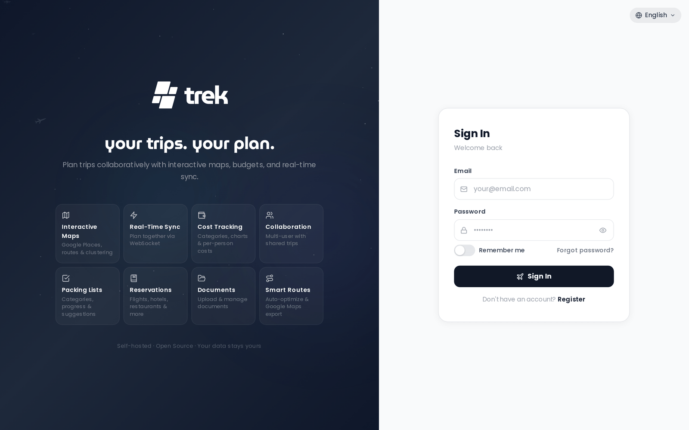

# Login and Registration

## Signing in

Navigate to `/login` and enter your email and password. On success, the server sets a `trek_session` cookie — httpOnly, sameSite=`lax`, and secure in production — that persists your session for 24 hours across page reloads and browser restarts. You do not need to sign in again until the session expires or you explicitly log out.

> **Note:** The `secure` flag on the cookie can be overridden by setting `COOKIE_SECURE=false` in the server environment (useful for plain-HTTP dev setups), or force-enabled with `FORCE_HTTPS=true`.

If your account has two-factor authentication enabled, you are prompted for a TOTP code (or backup code) after the password step before the session cookie is issued.

If you have forgotten your password, click the **"Forgot password?"** link below the password field to start the self-service reset flow. See [Password-Reset](Password-Reset) for details.

### Forced password change

If an admin has marked your account as requiring a password change, a **Set new password** form is shown immediately after a successful login (or after the MFA step). The session cookie is not issued until the new password is saved.

## Registering

The Register form appears under one of these conditions:

- **Open registration** — the admin has enabled password registration for the instance (`password_registration` setting).
- **Valid invite link** — you visited `/login?invite=TOKEN` with a valid token (see below).
- **First user** — no accounts exist yet; the registration form is shown automatically and the first account created becomes an admin.

Registration fields: **username**, **email**, and **password**.

### Password requirements

Passwords must meet all of the following rules:

- Minimum **8 characters**
- At least one **uppercase letter**
- At least one **lowercase letter**
- At least one **number**
- At least one **special character**
- Must not be a commonly used password
- Must not consist of a single repeated character

> **Admin:** You can disable open registration so only invite links work. See [Admin-Users-and-Invites](Admin-Users-and-Invites).

### Invite link flow

When an admin shares an invite link (`/login?invite=TOKEN`), visiting it:

1. Validates the token against the server.
2. Switches the login page to Register mode automatically.
3. Passes the token during registration so it counts against the invite's use limit.

If the token is invalid, expired, or exhausted, an error is shown.

## First user

On a fresh TREK instance with no existing accounts, the registration form opens immediately. The first account created is automatically assigned the **admin** role.

## Rate limiting

Failed login attempts are rate-limited to **10 attempts per 15-minute window** per IP address. After exceeding the limit, further attempts return HTTP 429 until the window resets.

MFA verification attempts are rate-limited separately to **5 attempts per 15-minute window** per IP address.

Forgot-password requests are rate-limited to **3 attempts per 15-minute window** per IP. Reset-password submissions are limited to **5 attempts per 15-minute window** per IP.

## Demo mode

When the server is started with `DEMO_MODE=true`, a **"Try demo"** button appears below the login form. Clicking it signs you in as the demo user without entering credentials. The demo credentials (`demo@trek.app` / `demo12345`) are also displayed in the app config for reference, but the one-click button is the intended entry point.

## SSO

If the admin has configured OpenID Connect, a **"Sign in with SSO"** button (labelled with the configured `OIDC_DISPLAY_NAME`, defaulting to `SSO`) appears below the login form. See [OIDC-SSO](OIDC-SSO) for details on setup and the sign-in flow.

When OIDC-only mode is active (password login disabled), visiting `/login` automatically redirects the browser to the identity provider. The email/password form is not shown. The automatic redirect is suppressed only when you have explicitly logged out, in which case the SSO button is shown instead so you can choose to sign back in.

---

**See also:** [OIDC-SSO](OIDC-SSO) · [Admin-Users-and-Invites](Admin-Users-and-Invites) · [Password-Reset](Password-Reset)
