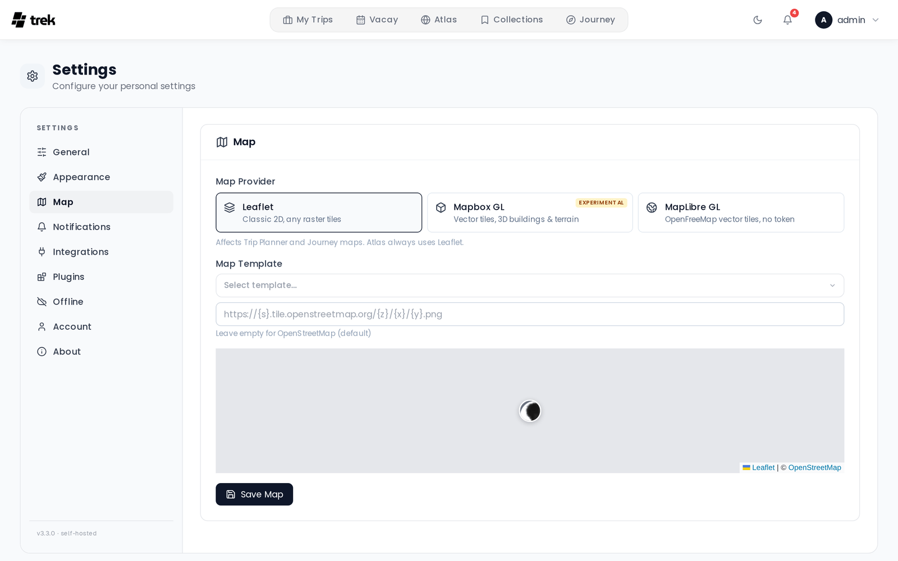

# Map Settings

The Map tab controls which map engine and tile source TREK uses in the Trip Planner and Journey maps.

> **Note:** The Atlas view always uses Leaflet regardless of this setting.

## Where to find it

Open the user menu in the top navigation bar, select **Settings**, then the **Map** tab. Unlike the General tab, changes here are not saved as you make them — click **Save Map** when you are done.

## Map provider

Choose the rendering engine:

| Provider | Description |
|----------|-------------|
| **Leaflet** | Classic 2D renderer. Works with any raster tile URL. No token. |
| **Mapbox GL** *(Experimental)* | Vector tiles with 3D buildings and terrain support. **Requires a Mapbox access token.** |
| **MapLibre GL** | Vector tiles from **OpenFreeMap**. **No access token required** — this is the reason to pick it over Mapbox GL. |

Each GL provider stores its style in its own slot (`mapbox_style` for Mapbox GL, `maplibre_style` for MapLibre GL), so switching providers never clobbers the other one's style.

## Leaflet — tile source

When Leaflet is selected, pick a preset or enter a custom tile URL.

**Built-in presets:**

| Name | URL |
|------|-----|
| OpenStreetMap | `https://{s}.tile.openstreetmap.org/{z}/{x}/{y}.png` |
| OpenStreetMap DE | `https://tile.openstreetmap.de/{z}/{x}/{y}.png` |
| CartoDB Light | `https://{s}.basemaps.cartocdn.com/light_all/{z}/{x}/{y}{r}.png` |
| CartoDB Dark | `https://{s}.basemaps.cartocdn.com/dark_all/{z}/{x}/{y}{r}.png` |
| Stadia Smooth | `https://tiles.stadiamaps.com/tiles/alidade_smooth/{z}/{x}/{y}{r}.png` |

You can also type any XYZ tile URL directly into the text field.

> **Admin:** The admin can set a default map tile URL for all new users via the **User Defaults** tab in the Admin Panel. See [Admin-Panel-Overview](Admin-Panel-Overview).

## Mapbox GL — access token and style

Enter your **public token** (`pk.*`) from [mapbox.com → Access tokens](https://console.mapbox.com/account/access-tokens/).

Required scopes are:
- STYLES:TILES
- STYLES:READ
- FONTS:READ
- DATASETS:READ
- VISION:READ

If Mapbox GL is selected but no token is saved, the map area shows an empty state with a prompt to configure the token under Settings → Map → Mapbox GL.

**Built-in style presets:**

| Style | Tags |
|-------|------|
| Mapbox Standard | 3D, Apple-like |
| Standard Satellite | 3D, Satellite |
| Streets | 3D, Classic |
| Outdoors | 3D, Terrain |
| Light | 3D, Minimal |
| Dark | 3D, Dark |
| Satellite | 3D, Satellite |
| Satellite Streets | 3D, Satellite |
| Navigation Day | 3D, Apple-like |
| Navigation Night | 3D, Dark |

You can also enter a custom `mapbox://styles/USER/ID` URL directly.

### 3D Buildings & Terrain

Enables pitch and building extrusions on all styles. Terrain elevation (DEM-based height) is additionally applied on satellite styles (`Satellite` and `Satellite Streets`). On non-satellite styles only building extrusions are added; terrain is intentionally omitted on those styles because the elevation data would cause route lines to visually drift away from the HTML place markers.

### High Quality Mode *(Experimental)*

Enables antialiasing and globe projection for sharper edges. May impact performance on lower-end devices.

## MapLibre GL — style

MapLibre GL renders OpenFreeMap vector tiles and needs **no token at all**, so there is no token field on this provider — just a style.

**Built-in style presets:**

| Style | URL |
|-------|-----|
| OpenFreeMap Liberty *(default)* | `https://tiles.openfreemap.org/styles/liberty` |
| OpenFreeMap Bright | `https://tiles.openfreemap.org/styles/bright` |
| OpenFreeMap Positron | `https://tiles.openfreemap.org/styles/positron` |

You can also type any `https://tiles.openfreemap.org/…` style URL. A style that is not an OpenFreeMap URL is rejected and replaced with Liberty when you save.

The **3D Buildings & Terrain** and **High Quality Mode** toggles are Mapbox-only and are not shown for MapLibre GL.

## Where a map opens

There is **no** default map center or zoom setting — it was removed in v3.4.0. Instead, every map works out its own opening camera from the places it is about to draw, so a trip in Japan opens on Japan instead of starting on the world view and then flying across the planet.

For each map, TREK takes the coordinates it is given and computes the center and zoom that frame them all:

- **Several places** — the camera fits their bounding box. The zoom is capped (16 on Leaflet, 15 on the GL renderers) so a tight cluster does not open absurdly far in, and the center is taken in projected (Mercator) space rather than as an average of the latitudes, so the northernmost place does not fall out of frame.
- **A single place** (or several stacked on the same spot) — there is no extent to fit, so it opens at city level: zoom 12 on Leaflet, 11 on the GL renderers.
- **Places spanning the date line** — MapLibre GL and Mapbox GL wrap the world, so a trip covering Fiji and Samoa is framed as the 10°-wide arc it really is. Leaflet does not wrap, so it takes the plain west-to-east span instead.
- **Side panels** — chrome overlaying the map shifts the center, so the places stay inside the part of the map you can actually see.
- **No usable coordinates** — a brand-new trip with nothing placed yet has nothing to frame, so the map falls back to a world view (center `0, 0` at zoom 2).

The small map preview on this settings page is the one exception: it stays on a fixed city (Paris, zoom 16) so you can judge label density, 3D buildings and satellite texture. It is not a setting and no real map opens there.

## See also

- [Map-Features](Map-Features)
- [Admin-Panel-Overview](Admin-Panel-Overview)
- [User-Settings](User-Settings)
