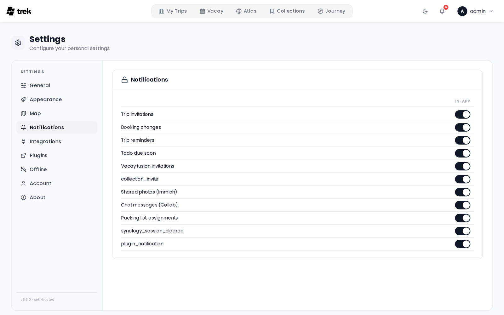

# Notifications

The Notifications tab (Settings → Notifications) lets you choose which events notify you and through which channels. Each toggle saves immediately.

<!-- TODO: screenshot: notifications panel or bell dropdown -->

## Notification channels

TREK ships four delivery channels, and a plugin can add more. Which channels appear depends on what the admin has enabled server-side.

| Channel | Description |
|---------|-------------|
| **In-app** | Bell icon in the navigation bar. Always available. Delivered in real time via WebSocket. |
| **Email** | Delivered to your account email. Requires the admin to configure SMTP. |
| **Webhook** | TREK POSTs a JSON payload to a URL you specify. Discord and Slack webhook URLs are auto-detected and receive a natively formatted payload. |
| **ntfy** | Push notifications via [ntfy.sh](https://ntfy.sh) or a self-hosted ntfy server. |

### Plugin channels

A plugin can register an **additional channel** — Gotify, Pushover, Telegram, anything that
takes a message — by implementing the `notificationChannel` hook. See
[Plugin-Development](Plugin-Development.md#notification-channels).

Once the admin installs the plugin and switches its channel on, it appears as a new column in
the preferences matrix beside Email and In-App, and behaves like any other channel: each user
supplies their own credentials (in the plugin's own settings) and picks per-event which
notifications they want on it.

Two things are true of plugin channels specifically:

- **They are user-scoped.** Admin-only events (like `version_available`) always go out over the
  built-in admin channels, never a plugin's.
- **The plugin never sees your trips.** The notification is rendered by TREK — in your language,
  with the deep link already built — before the plugin is handed it. The plugin gets that message
  and your own credentials for its service, and nothing else.

## Notification events

The following events are configurable in user settings:

| Event | Description |
|-------|-------------|
| `trip_invite` | Someone invited you to a trip |
| `booking_change` | A booking was added, updated, or removed in a trip you're part of |
| `trip_reminder` | Reminder before a trip starts |
| `vacay_invite` | You were invited to fuse vacation plans |
| `photos_shared` | Photos were shared with a trip |
| `collab_message` | A new message in a collaborative trip |
| `packing_tagged` | You were assigned to a packing category in a trip |
| `plugin_notification` | An installed plugin sent you a notification (only plugins granted the `notify:send` capability can do this) |

All user-facing events support all four channels (in-app, email, webhook, ntfy). A dash (—) in the matrix means that channel/event combination is not implemented.

### Admin-only events

The following events are shown in the admin panel (Admin → Notifications) and are not configurable per user:

| Event | Description | Channels |
|-------|-------------|---------|
| `version_available` | A new TREK version is available | in-app, email, webhook, ntfy |

### System-only events

The following events are fired automatically and are not exposed as toggles in any settings panel:

| Event | Description | Channels |
|-------|-------------|---------|
| `synology_session_cleared` | Your Synology account or URL changed, clearing your Photos session | in-app only |

## Configuring the matrix

The preferences panel shows a grid of events × channels. Toggle each intersection independently. Changes are saved automatically.

## Webhook configuration

Enter a URL that TREK will POST to when a notification fires. Once saved, the URL is displayed as `••••••••`. Use the **Test** button to send a test payload to the saved URL.

TREK auto-detects the webhook destination and adjusts the payload format:

- **Discord** (`discord.com/api/webhooks/…`) — sends a rich embed with title, description, and a timestamp.
- **Slack** (`hooks.slack.com/…`) — sends a formatted Slack message block.
- **Generic** — sends a plain JSON object with `event`, `title`, `body`, `tripName`, `link`, `timestamp`, and `source` (`"TREK"`) fields.

## ntfy configuration

Enter your ntfy **topic** and optionally a custom **server URL** (defaults to the server-wide ntfy server set by the admin) and an **access token** for private topics. The token is stored encrypted and displayed as `••••••••` after saving. Use the **Test** button to verify delivery.

## In-app notification center

The bell icon in the navigation bar shows your unread notification count. Click it to open the notification panel where you can:

- Mark individual items read or unread.
- Mark all notifications read at once.
- Delete individual notifications or clear all at once.
- Respond to **boolean notifications** (e.g. trip invites that offer Accept / Decline actions directly in the panel).

In-app notifications are pushed in real time via WebSocket so the badge and panel update without a page refresh.

## Per-trip preferences

Notification preferences are configured globally in Settings → Notifications. There are no per-trip overrides — the same toggle applies across all trips.

## See also

- [Environment-Variables](Environment-Variables)
- [User-Settings](User-Settings)
