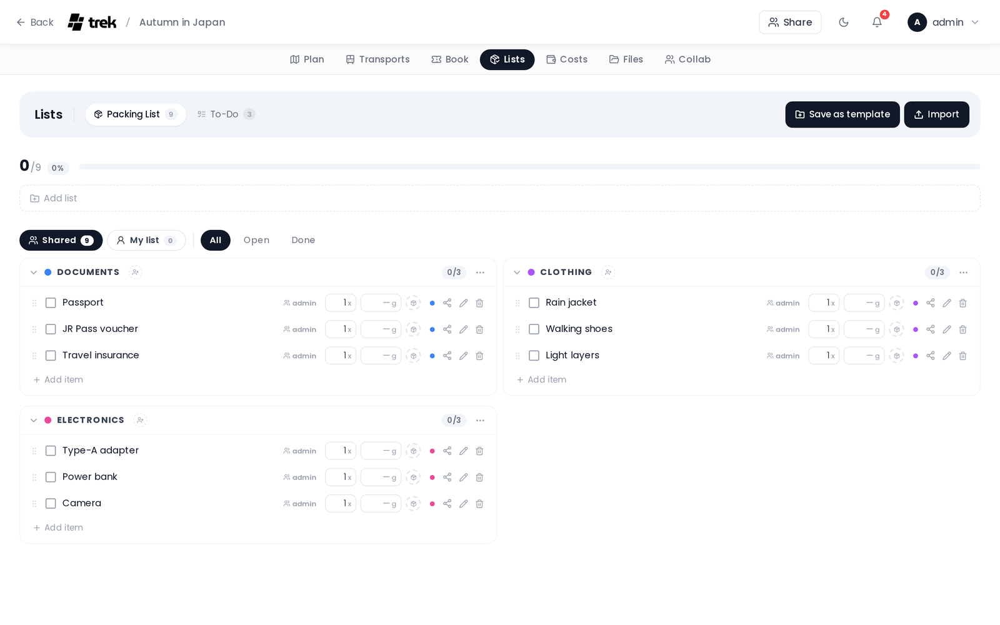

# Packing Lists

Create categorized packing checklists with member assignments and optional bag tracking.

<!-- TODO: screenshot: packing list with checked items and categories -->

## Where to find it

Open the **Lists** tab inside the trip planner and select **Packing**. The tab is only visible when the Packing addon is enabled.

> **Admin:** Enable the Packing addon and optionally turn on Bag Tracking in [Admin-Addons](Admin-Addons).

## Progress bar

A progress bar shows how many items have been checked (packed) out of the total. It is hidden on small screens and visible on larger viewports. When all items are checked, a completion message replaces the bar.

## Filters

Three filter buttons let you narrow the item view:

- **All** — every item regardless of checked state.
- **Open** — unchecked items only.
- **Done** — checked items only.

## Categories

Items are grouped into categories. Each category has a colored dot that cycles through a 10-color palette. When you create a new packing list, suggested items are pre-populated in these categories: **Documents** (Passport, Travel Insurance, Visa Documents, Flight Tickets, Hotel Bookings, Vaccination Card), **Clothing** (T-Shirts (5x), Pants (2x), Underwear (7x), Socks (7x), Jacket, Swimwear, Sport Shoes), **Toiletries** (Toothbrush, Toothpaste, Shampoo, Sunscreen, Deodorant, Razor), **Electronics** (Phone Charger, Travel Adapter, Headphones, Camera, Power Bank), **Health** (First Aid Kit, Prescription Medication, Pain Medication, Insect Repellent), and **Finances** (Cash, Credit Card).

Each category header has a collapse/expand toggle and an overflow menu with these actions:

- **Check all** — mark every item in the category as packed.
- **Uncheck all** — unmark every item in the category.
- **Rename** — rename the category.
- **Delete** — delete the category and all its items.

### Assigning members to a category

Use the people-picker chip row in the category header to assign trip members to that category. Assigned members receive a packing notification. See [Notifications](Notifications) for details.

## Items

Each item row contains:

- A **checkbox** to mark the item packed.
- An editable **name** (click to rename; renaming is disabled while an item is checked).
- A **quantity** field (always visible).
- When bag tracking is enabled: a **weight** field (in grams) and a **bag picker**.

Hovering over an item reveals a **category picker** (colored dot), a **rename** button (pencil icon), and a **delete** button. Add new items using the inline "add item" row at the bottom of each category.

## Sharing packing items

Every packing item has a sharing tier that controls who sees it and who is bringing it. By default everything sits in the shared group pool, exactly as before — the tiers are opt-in per item.

### The two views

Two pills at the top of the list switch what you're looking at:

- **Shared** — the group pool: items everyone on the trip can see.
- **My list** — your own items: your personal items, things you've been asked to bring, and things you shared with specific people.

Each pill shows a count of the items in it.

### The three tiers

Open an item's **Sharing** control (the share icon on the row) to move it between tiers:

- **Shared** — *In the group pool, visible to everyone.* This is where every item starts.
- **Personal** — *Private — only you can see it.*
- **Shared with…** — pick specific trip members below the two tier options. The item then shows only on your list and on theirs. (If you're the only one on the trip, this reads *No one else on this trip yet*.)

New items inherit the view you add them in: adding an item while in **My list** makes it Personal, adding it in **Shared** makes it Common. To share an item with specific people, add it first, then open its Sharing control and choose them.

Only the item's owner (the person bringing it) can change its sharing. Someone you shared an item *with* just sees it on their **My list** with a **by {name}** badge and can tick it off — they don't manage who else it's shared with.

### Who's bringing what

Every item in the **Shared** pool shows who is bringing it. For an item someone else added, other members see two quick actions instead of the Sharing control:

- **I can bring that too** — pledge to co-bring it. The item's badge then shows a **+1** next to the original bringer. Tap again (*I'm not bringing it*) to withdraw.
- **Copy to my list** — clone the item onto your own personal list as a separate private copy, leaving the shared one untouched.

> Items created before this feature have no assigned bringer, so they show no "brought by" badge until someone edits their sharing.

> **Note:** this per-item sharing is separate from assigning **members to a category** (above). Category assignments only send a packing notification — they don't change who can see an item.

All of this is still gated by the `packing_edit` permission; there is no extra addon or admin toggle.

## Bag tracking

Bag tracking is only available when an admin has enabled it.

> **Admin:** Turn on Bag Tracking in [Admin-Addons](Admin-Addons).

When enabled, a **Bags** panel appears as a right-hand sidebar on wide screens, or as a modal sheet on narrow screens (tap the **Bags** button in the header to open it). Each bag shows:

- Name and color dot.
- Total weight and a weight-limit progress bar (if a limit is set).
- Member avatars assigned to that bag.
- Item count.

The sidebar also shows an **unassigned** section for items that have no bag, and a **total weight** line summing all items.

To use bags:

1. Click **+ Add bag** to create a bag with a name and color.
2. Assign items to a bag using the bag picker on each item row (visible when bag tracking is enabled).
3. Assign members to a bag using the member chip row on the bag card.

## Templates

You can save and reuse packing lists across trips:

- **Save as Template** — click the **Save as Template** button in the header (visible when the list has items) to save the current list's items and categories as a named template.
- **Apply Template** — if templates exist, an **Apply Template** dropdown appears in the header. Selecting a template appends its items to the current list without removing existing items.

Templates are managed by admins in [Admin-Packing-Templates](Admin-Packing-Templates).

## Permissions

All write operations require the `packing_edit` permission.

## See also

- [Packing-Templates](Packing-Templates)
- [Admin-Addons](Admin-Addons)
- [Notifications](Notifications)
- [Trip-Planner-Overview](Trip-Planner-Overview)
