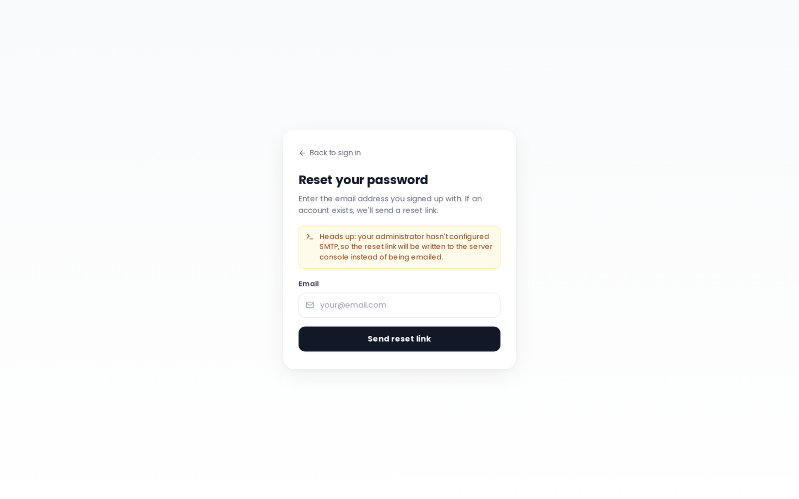

# Password Reset

## Self-service reset (Forgot password?)

TREK supports email-based self-service password reset. On the login page, click the **"Forgot password?"** link to go to `/forgot-password`. Enter your email address and submit — if the address matches a local account, a reset link is sent to that inbox. The page always shows the same confirmation message regardless of whether the email was found, to prevent account enumeration.

> **No SMTP configured?** When the server has no SMTP credentials set up, the reset link is not emailed. Instead, it is printed to the **server console** inside a clearly-fenced block so a self-hoster can copy and relay it manually. The forgot-password page also shows a visible hint that SMTP is unconfigured.

### Reset flow

1. Click **"Forgot password?"** on the login page.
2. Enter your email address and submit.
3. Open the reset link from your email (or console) — valid for **60 minutes**.
4. Enter a new password. If your account has **MFA enabled**, you must also supply a valid TOTP code or backup code before the reset completes.
5. After a successful reset you are redirected to login. **All existing sessions are invalidated** — every device is signed out immediately.

### Security properties

| Property | Detail |
|---|---|
| Token entropy | 256-bit cryptographically random, base64url-encoded |
| Storage | Only the SHA-256 hash is stored in the database — never the raw token |
| Expiry | 60 minutes, single-use; any prior unconsumed token is invalidated when a new one is issued |
| Enumeration safety | `/forgot-password` always returns `{ok:true}` with a minimum response latency pad |
| Rate limiting | 3 requests / 15-min per IP on `/forgot-password`; 5 requests / 15-min per IP on `/reset-password` |
| MFA gate | If the account has 2FA enabled, a valid TOTP code or backup code is required to complete the reset — a compromised mailbox alone cannot take over a 2FA-protected account |
| Session invalidation | Resetting the password bumps the `password_version` on the account and the `pv` claim in all JWTs, which immediately rejects every live session |
| Audit log | `user.password_reset_request`, `user.password_reset_success`, and `user.password_reset_fail` events are recorded |

### SMTP requirement

The email delivery uses the same SMTP settings as other notification emails. See [Environment-Variables](Environment-Variables) for `SMTP_*` configuration.

### OIDC accounts

Accounts that signed up via SSO and have no local password set cannot use the forgot-password flow — there is no local password to reset. The forgot-password page still shows the generic confirmation to avoid revealing whether the email is OIDC-only. Continue using [OIDC-SSO](OIDC-SSO) to sign in.

### Password login disabled

If the admin has globally disabled password login, the forgot-password endpoint returns an error and the flow is unavailable.

## Admin-initiated reset

An admin can set a new password for any user directly from the admin panel (**Admin → Users**). The admin enters a new password for the account, which is saved immediately — no email is required. The admin can also enable the **"Force password change on next login"** flag so the user is prompted to choose their own password the next time they sign in.

See [Admin-Users-and-Invites](Admin-Users-and-Invites) for step-by-step instructions.

## Password requirements

When choosing a new password (whether via the reset flow, the forced-change prompt, or the normal **Settings → Security** page) the password must:

- Be at least **8 characters** long
- Contain at least one **uppercase letter**
- Contain at least one **lowercase letter**
- Contain at least one **number**
- Contain at least one **special character**
- Not be a commonly used password

## Rate limiting

| Endpoint | Limit |
|---|---|
| `/auth/forgot-password` | 3 requests / 15-min per IP |
| `/auth/reset-password` | 5 requests / 15-min per IP |
| Password change (settings) | Rate-limited per IP |

---

**See also:** [Login-and-Registration](Login-and-Registration) · [Admin-Users-and-Invites](Admin-Users-and-Invites) · [Two-Factor-Authentication](Two-Factor-Authentication) · [OIDC-SSO](OIDC-SSO)
