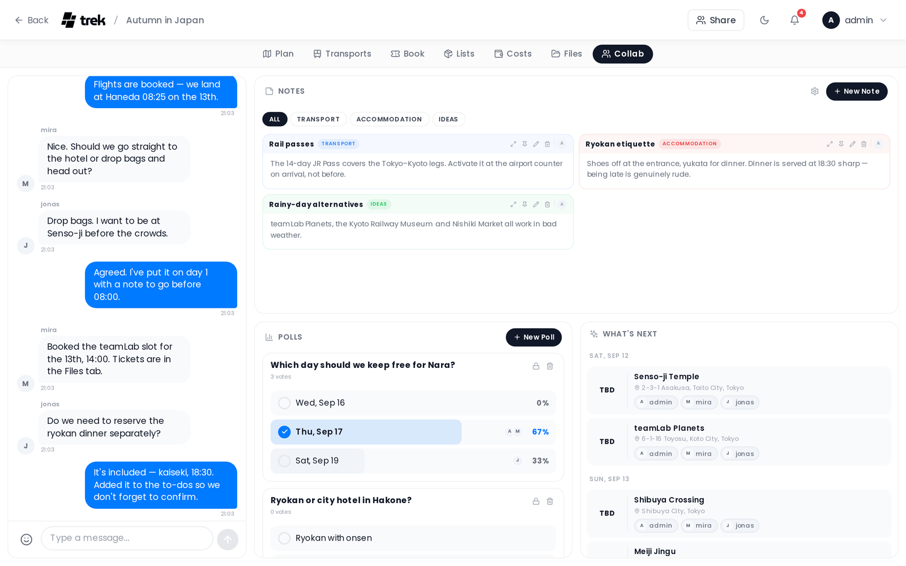

# Real-Time Collaboration

TREK keeps every trip in sync across all connected members without requiring a page refresh. A dedicated **Collab addon** adds a second layer on top of that sync: group chat, shared notes, polls, and a "What's Next" widget showing upcoming assigned places.

## Real-time sync

All changes to a trip — places, day plans, reservations, budget entries, and packing lists — are broadcast instantly to every connected member via WebSocket. You see other people's edits as they happen.

## WebSocket transport

| Parameter | Value |
|-----------|-------|
| Path | `/ws` |
| Scope | One room per trip |
| Rate limit | 30 messages per 10-second window |
| Max payload | 64 KB per message |
| Heartbeat | Ping every 30 seconds; sockets that miss a pong are terminated |

**Authentication** uses a short-lived ephemeral token passed as a query parameter on connect. If authentication fails, the server closes the connection with one of these codes:

- **4001** — missing, invalid, or expired token; user not found
- **4403** — site-wide MFA is required but the account does not have MFA enabled

## The Collab addon

The Collab addon (`collab`) must be enabled by an admin before the panel is visible inside a trip. Once enabled, it provides four sub-features that can each be toggled independently:

| Sub-feature | What it provides |
|-------------|-----------------|
| **Chat** | Group chat with reactions, replies, and URL previews |
| **Notes** | Categorized, pinnable, markdown-formatted shared notes |
| **Polls** | Single- or multiple-choice votes with optional deadlines |
| **What's Next** | Upcoming assigned places across all trip days |

> **Admin:** enable the Collab addon and individual sub-features in [Admin-Addons](Admin-Addons).

On **desktop** the panel shows Chat as a fixed 380 px column on the left when other sub-features are also enabled; if only Chat is on, it expands to fill the full width. Notes, Polls, and What's Next share the remaining space on the right. On **mobile** a tab bar at the top lets you switch between the enabled sub-features one at a time. Disabled sub-features are hidden from the tab bar.

## Conflict handling

TREK uses a **last-write-wins** model. Each mutation is applied on the server and the resulting canonical state is broadcast to all connected clients. If two members edit the same field at the same time, the change that reaches the server last is the one that sticks; all clients converge to that server-authoritative state.

On reconnect, any locally queued mutations are flushed to the server before the client re-fetches trip data, so offline changes are applied before the latest state is read back.

There is no operational-transform or CRDT merge — simultaneous edits to the same field are not merged; one silently wins.

## Access control

All Collab reads require trip membership. Writing — sending messages, creating notes, creating polls, voting — requires the `collab_edit` permission. Members without `collab_edit` can read but cannot post or interact.

## Related pages

[Collab-Chat](Collab-Chat) · [Collab-Notes](Collab-Notes) · [Collab-Polls](Collab-Polls) · [Whats-Next-Widget](Whats-Next-Widget) · [Trip-Planner-Overview](Trip-Planner-Overview) · [Admin-Addons](Admin-Addons)
