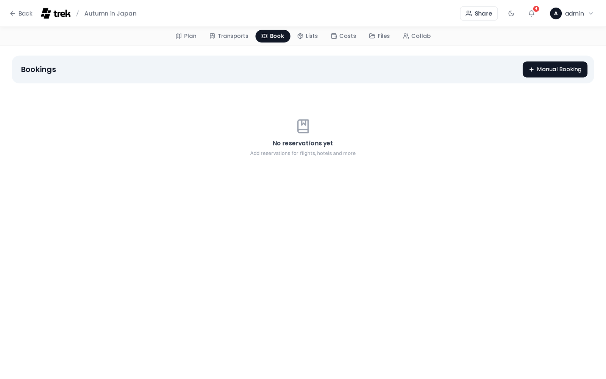

# Reservations & Bookings

Track all your trip bookings — hotels, restaurants, events, tours, and more — in one place.

## Where to find it

Open your trip in the planner and select the **Reservations** tab. The panel lists all bookings grouped by status, with a type filter bar at the top.

## Reservation types

TREK supports nine reservation types:

| Type | How to create |
|------|--------------|
| Flight | [Transport modal](Transport-Flights-Trains-Cars) |
| Train | [Transport modal](Transport-Flights-Trains-Cars) |
| Car | [Transport modal](Transport-Flights-Trains-Cars) |
| Cruise | [Transport modal](Transport-Flights-Trains-Cars) |
| Hotel | Add button in Reservations panel — see [Accommodations](Accommodations) |
| Restaurant | Add button in Reservations panel |
| Event | Add button in Reservations panel |
| Tour | Add button in Reservations panel |
| Other | Add button in Reservations panel |

Transport types (Flight, Train, Car, Cruise) are created through the dedicated Transport modal, where you can enter endpoint and transit-specific fields. All other types are created directly from the Reservations panel.

## Pending and Confirmed

Reservations are grouped into two collapsible sections: **Pending** and **Confirmed**. You can collapse or expand each section independently — the open/closed state is saved per trip so it persists across page reloads. Status is set when you create or edit a reservation.

On desktop, a type filter bar lets you show only specific types. Filter selections are kept for the current browser session.

## Reservation card contents

Each card displays:

- **Status dot** — green for Confirmed, amber for Pending
- **Type chip** — icon and label for the reservation type
- **Needs review badge** — an amber badge shown on reservations flagged by importers that may need your attention
- **Title** — the reservation name
- **Edit and delete buttons** — visible only if you have edit permission

> **Admin:** Edit and delete buttons are gated by the `reservation_edit` permission. Members without this permission see read-only cards.

- **Date and time range** — start date, and end date/time if set
- **From → To** — origin and destination endpoints, shown for transport types
- **Confirmation code** — displayed in monospace. If you have **Blur booking codes** enabled in Display Settings, the code is blurred by default and revealed on hover or tap
- **Type-specific metadata:**
  - Flights: airline name, flight number
  - Trains: train number, platform, seat
  - Hotels: check-in window, check-out time (see [Accommodations](Accommodations))
- **Location / address** — for non-hotel, non-transport types
- **Linked accommodation** — hotel name, if this reservation is linked to an accommodation record
- **Day-plan assignment** — the day and place this reservation is linked to
- **Notes**
- **Attached files** — shown as clickable download links

## Creating a reservation

Click **Add** (or the + button) in the Reservations panel. Fill in the form:

1. **Type** — choose Hotel, Restaurant, Event, Tour, or Other
2. **Title** — required
3. **Link to day-plan assignment** — optional; search across all days and places, grouped by day. Not available for Hotel type
4. **Start date and time** — not shown for Hotel type
5. **End date and time** — not shown for Hotel type
6. **Location / address** — not shown for Hotel type
7. **Confirmation code**
8. **Status** — Pending or Confirmed
9. **Hotel-specific fields** — shown only for Hotel type, immediately after status: hotel place, check-in day, check-out day, check-in time (window start and end), and check-out time. See [Accommodations](Accommodations)
10. **Notes**
11. **Files** — attach from your device (PDF, Word documents, text files, images) or link an existing trip file. Files added before saving are uploaded automatically after the reservation is created
12. **Price and budget category** — shown only when the Budget addon is enabled. Entering a price greater than zero automatically creates a linked budget entry. See [Budget-Tracking](Budget-Tracking)

<!-- TODO: screenshot: Create Reservation modal -->

## Import from booking confirmation

TREK can parse booking confirmation emails, PDFs, and pass files and create reservations automatically using [KDE Itinerary](https://apps.kde.org/itinerary/).

### Supported formats

| Format | Extension |
|--------|-----------|
| Booking confirmation email | `.eml` |
| PDF ticket or confirmation | `.pdf` |
| Apple Wallet pass | `.pkpass` |
| HTML confirmation page | `.html`, `.htm` |
| Plain-text email | `.txt` |

Up to 5 files, 10 MB each, per import.

### How to import

1. Open the **Reservations** tab.
2. Click the **Import** (download) button in the toolbar — the button is only shown when the extractor is available on your server.
3. Drag and drop your files onto the upload area, or click to browse.
4. TREK parses each file and shows a **preview list** of the detected reservations with type, title, dates, endpoints, and confirmation number.
5. Deselect any items you do not want to import by clicking the × on their card.
6. Click **Confirm** to create the selected reservations.

All created reservations appear immediately in the panel and are broadcast to all connected trip members in real time.

### What gets created automatically

- **Hotels** — a reservation *and* a linked accommodation row in the day plan (check-in/check-out dates are read from the confirmation).
- **Hotels / Restaurants / Events** — the venue is auto-created as a place with coordinates when the extractor returns location data.
- **All types** — a budget entry is created if the Budget addon is enabled and a price is present.

### When the button is not visible

The Import button is hidden when the `kitinerary-extractor` binary is not available. The binary ships inside the official TREK Docker image. If you run TREK from source, install the `libkitinerary-bin` package (Debian trixie / Ubuntu 25.04+) or set `KITINERARY_EXTRACTOR_PATH` to the binary's full path. See [Environment-Variables](Environment-Variables).

### Needs review flag

Items that the extractor could only partially parse are flagged **Needs review** — an amber badge on the card. Review these reservations after import and fill in any missing fields manually.

### AI fallback for hard-to-read files

KDE Itinerary only recognises structured tickets. For confirmations it can't read — plain-text emails, unusual PDF layouts, vendors it doesn't know — TREK can optionally hand the file to an AI model instead. The optional **AI Parsing** addon runs only for the files Itinerary returns nothing for, parses them in the background, and flags every result for review before you save it. It works with a self-hosted local model, so booking data need not leave your server. See **[AI-Booking-Import](AI-Booking-Import)**.

## Editing and deleting

Each card has a pencil icon to open the edit form and a trash icon to delete. Deleting requires confirmation in a dialog before the record is removed.

## Real-time sync

Reservation changes (create, update, delete) are broadcast instantly to all connected trip members via WebSocket, so everyone sees the latest state without refreshing.

---

**See also:** [Transport-Flights-Trains-Cars](Transport-Flights-Trains-Cars) · [Accommodations](Accommodations) · [Budget-Tracking](Budget-Tracking) · [Documents-and-Files](Documents-and-Files) · [Trip-Planner-Overview](Trip-Planner-Overview)
