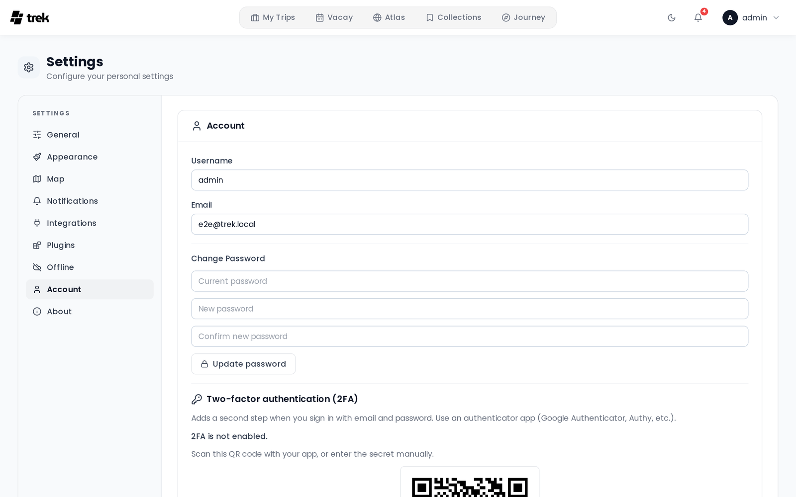

# Two-Factor Authentication

## What it is

TREK supports Time-based One-Time Password (TOTP) two-factor authentication, compatible with Google Authenticator, Authy, 1Password, and any standard TOTP app. When 2FA is active, you enter a 6-digit code (or a backup code) after your password on each login.

## Setting up 2FA

Go to **Settings → Account** and click **"Set up two-factor authentication"**.

1. A QR code and a text secret are displayed. Scan the QR code with your authenticator app.
   > **Note:** The setup session expires after **15 minutes**. If you do not complete setup within that window, start again.
2. Enter the 6-digit code shown in your authenticator app and click **Confirm**.
3. Save your **10 backup codes**. These are single-use codes shown only once — store them somewhere safe (a password manager, printed paper). Each code has the format `XXXX-XXXX`.
4. 2FA is now active on your account.

## Logging in with 2FA

After entering your email and password, TREK shows a second prompt for your TOTP code. You have **5 minutes** to complete this second step before the intermediate session token expires. Enter either:

- The current 6-digit code from your authenticator app, or
- One of your backup codes (format `XXXX-XXXX`). Each backup code can only be used once.

## Disabling 2FA

Go to **Settings → Account** and click **"Disable two-factor authentication"**. You must provide both:

- Your current account **password**
- A valid **TOTP code** from your authenticator app

> **Note:** You cannot disable 2FA while the admin has required it for all users (see below).

## Admin-enforced 2FA

An admin can require 2FA for all users. Before enabling this setting the admin must have 2FA active on their own account — the server rejects the change otherwise.

If the setting is active and your account does not have 2FA set up, any API request after login returns a 403 error and the client redirects you to **Settings → Account** with a prompt to complete 2FA setup. You cannot use the app until setup is complete. See [Admin-Permissions](Admin-Permissions).

> **Admin:** You can reset 2FA for a locked-out user from the admin panel. See [Admin-Users-and-Invites](Admin-Users-and-Invites).

## Rate limits

TREK enforces IP-based rate limits to protect against brute-force attacks:

| Endpoint | Limit |
|---|---|
| Login (`/api/auth/login`) | 10 attempts per 15 minutes |
| MFA code verification (`/api/auth/mfa/verify-login`) | 5 attempts per 15 minutes |

Exceeding a limit returns HTTP 429. Wait for the window to reset before retrying.

## Demo users

The demo user account cannot enable or disable MFA.

---

**See also:** [Login-and-Registration](Login-and-Registration) · [Admin-Permissions](Admin-Permissions) · [Admin-Users-and-Invites](Admin-Users-and-Invites) · [User-Settings](User-Settings)
