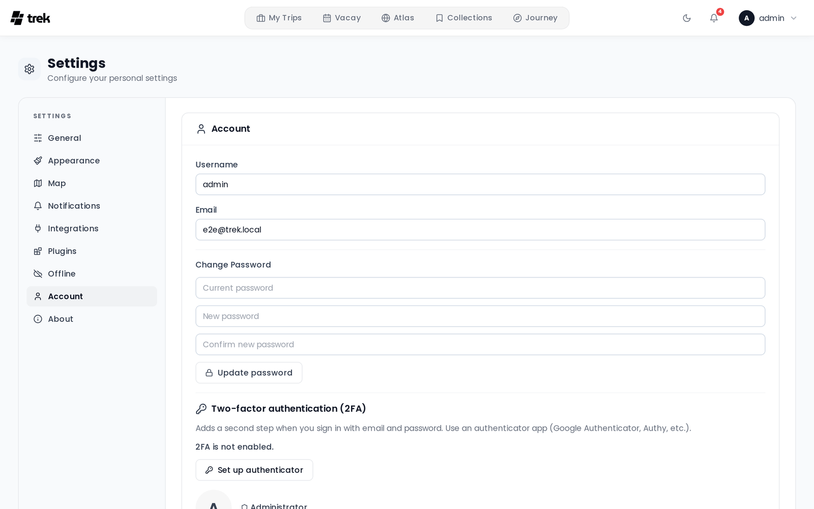

# User Settings

The Settings page lets you personalise every aspect of TREK — appearance, maps, notifications, offline behaviour, and your account.

## Navigating to Settings

Open the user menu in the top navigation bar and select **Settings**. The page opens on the **General** tab by default.

If your account requires MFA setup, TREK redirects you directly to the **Account** tab (via `?mfa=required`).

## Tabs

| Tab | Purpose | Shown when |
|-----|---------|------------|
| General | Currency, language, temperature unit, distance unit, time format, booking route labels, map POI pills, and blur booking codes | Always |
| Appearance | Color mode, color scheme / accent, readability (transparency, reduce motion, density, text size), and which widgets appear on your dashboard | Always |
| Map | Map provider (Leaflet, Mapbox GL, or MapLibre GL), tile presets, map style and Mapbox token, 3D buildings, high-quality mode | Always |
| Notifications | Email, webhook, ntfy, and in-app notification preferences | Always |
| Integrations | Photo providers (Immich, Synology, etc.) and MCP OAuth clients / API tokens | Only when the Memories or MCP addon is enabled |
| Plugins | Per-user settings for installed plugins | Only when at least one plugin is installed |
| Offline | Cached trips, pending changes, re-sync and clear cache | Always |
| Account | Username, email, password, MFA (TOTP + backup codes), avatar, delete account | Always |
| About | App version, links to Ko-fi / Buy Me a Coffee / Discord / GitHub (bug reports, feature requests) / Wiki | Only when version metadata is available |

## General tab

The General tab controls the following preferences, all saved immediately on change. See [Display-Settings](Display-Settings) for the detail.

**Language & region**

- **Currency** — your display currency; **Trip currency** (the default) shows each trip in its own. See [Currencies](Currencies).
- **Language** — displayed as a button grid on desktop and a dropdown on mobile.
- **Temperature unit** — Celsius (°C) or Fahrenheit (°F).
- **Distance unit** — Metric (km) or Imperial (mi).
- **Time format** — 24h (14:30) or 12h (2:30 PM).

**Travel & map**

- **Booking route labels** — show or hide station / airport names on booking route endpoint markers.
- **Explore places on the map** — show a POI category pill on the trip map for finding nearby places from OpenStreetMap.
- **Blur booking codes** — blur confirmation codes and reference numbers (useful when screen-sharing).

## Appearance tab

- **Color mode** — Light, Dark, or Auto (follows your operating system / browser preference).
- **Color scheme** — a preset accent, or **Custom** with your own light and dark accent colors.
- **Readability** *(Experimental)* — transparency, reduce motion, density, and text size.
- **Dashboard widgets** — which widgets appear on the dashboard, independently for desktop and mobile.

See [Appearance-Settings](Appearance-Settings) for the detail.

## Map tab

The Map tab requires an explicit **Save** action after making changes.

**Provider** — choose between:

- **Leaflet** — Classic 2D raster tiles. You can pick from built-in presets (OpenStreetMap, OpenStreetMap DE, CartoDB Light/Dark, Stadia Smooth) or enter a custom tile URL template.
- **Mapbox GL** (Experimental) — Vector tiles with 3D buildings and terrain. Requires a public Mapbox access token (`pk.*`). Supports built-in style presets (Mapbox Standard, Standard Satellite, Streets, Outdoors, Light, Dark, Satellite, Satellite Streets, Navigation Day, Navigation Night) or a custom `mapbox://styles/USER/ID` URL. Additional options:
  - **3D Buildings & Terrain** — Pitch and real 3D building extrusions (works on every style including satellite).
  - **High Quality Mode** (Experimental) — Antialiasing + globe projection for sharper edges. May impact performance on lower-end devices.
- **MapLibre GL** — Vector tiles from **OpenFreeMap**, and the reason to pick it over Mapbox GL: **it needs no access token**. Styles are OpenFreeMap Liberty, Bright, and Positron, or any `https://tiles.openfreemap.org/…` style URL. The 3D and high-quality toggles are Mapbox-only and are not shown here.

Each GL provider keeps its own saved style, so switching between Mapbox GL and MapLibre GL never overwrites the other one's choice.

> Atlas always uses Leaflet regardless of the provider setting.

**Opening view** — there is no default map center or zoom setting. Every map frames itself on the places it is showing. See [Map-Settings](Map-Settings).

## Account tab summary

The Account tab lets you:

- Edit your **username** and **email address**.
- Change your **password** (hidden when the server runs in OIDC-only mode — see [OIDC-SSO](OIDC-SSO)).
- Set up or disable **two-factor authentication** (TOTP). After enabling MFA, backup codes are shown once and can be copied, downloaded, or printed. See [Two-Factor-Authentication](Two-Factor-Authentication).
- Upload or remove your **profile avatar**.
- **Delete your account** (irreversible; blocked if you are the only admin).

If your account was linked via SSO, an **SSO** badge appears next to your role and the OIDC issuer domain is shown below it.

## Integrations tab

The Integrations tab is only visible when the **Memories** or **MCP** addon is enabled. It contains:

- **Photo Providers** — Configure Immich, Synology Photos, and other photo integrations (always shown when the Integrations tab is visible).
- **MCP section** (only when MCP addon is enabled):
  - Shows the MCP server endpoint URL.
  - **OAuth Clients** sub-tab — Create and manage OAuth 2.1 clients (with redirect URIs and scopes). Quick-fill presets are provided for Claude.ai, Claude Desktop, Cursor, VS Code, Windsurf, and Zed. Active OAuth sessions can be viewed and revoked here.
  - **API Tokens** sub-tab (Deprecated) — Create and manage personal bearer tokens for direct MCP access.

## See also

- [Display-Settings](Display-Settings)
- [Appearance-Settings](Appearance-Settings)
- [Map-Settings](Map-Settings)
- [Notifications](Notifications)
- [Offline-Mode-and-PWA](Offline-Mode-and-PWA)
- [Two-Factor-Authentication](Two-Factor-Authentication)
- [Languages](Languages)
