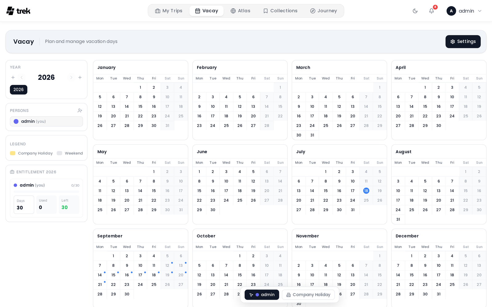

# Vacay

Vacay is a personal vacation day planner that lives separately from your trip planning. It tracks how many vacation days you have per year, how many you have used, and what remains.

> **Admin:** enable Vacay in [Admin-Addons](Admin-Addons).

## What Vacay is

While trips in TREK represent specific travel plans, Vacay tracks your annual leave entitlement — the number of vacation days granted by your employer or contract, which days you have already logged, and the balance left. It is personal by default, but you can fuse your plan with another TREK user to see each other's calendars side by side.

## Accessing Vacay

When the admin has enabled the Vacay addon, a **Vacay** entry appears in the main navigation. Each user gets their own plan automatically when they first open the page.

## Year plans

Vacay is organised by year. You can have multiple years active at once and navigate between them with the year selector in the sidebar.

For each year, your entitlement panel shows:

- **Entitlement days** — your vacation allowance for that year (editable inline by clicking the field).
- **Used** — days you have logged on the calendar.
- **Remaining** — entitlement plus any carried-over days, minus used days.

**Carry-over** — when `carry_over_enabled` is on, unused days from the previous year are automatically added to the next year's total. When you toggle this setting, the carry-over amount is recalculated across all existing year records. Turn it off to zero out all carry-over balances.

## Calendar view

The main area shows a full 12-month grid. Each cell represents one day. Click a day to log or remove a vacation entry. Logged days are colour-coded by person when collaborators are fused into your plan.

Days that overlap with any of your existing TREK trips are marked with a small blue dot in the corner.

You can also switch the calendar toolbar to **Company** mode to mark shared company holidays, which are highlighted in amber and do not deduct from personal allowances.

**Settings** (gear icon) let you configure:

- **Block weekends** — prevents logging on weekend days. You choose which days count as the weekend.
- **Week start** — Monday or Sunday.
- **Carry-over** — toggle as described above.
- **Company holidays** — enable a shared company holiday layer that any fused user can edit.
- **Public holidays** — add one or more country/region holiday calendars so that public holidays appear on the grid. Holiday data is fetched from the nager.at public holiday API. Each calendar has a label, a colour, and a country or region selector (sub-national regions such as German states or Swiss cantons are supported).

## Inviting collaborators

You can invite other TREK users to fuse their Vacay plan with yours. Once a user accepts, your plans are merged: you see each other's logged days in distinct colours, and you can log days on behalf of the other person if needed.

To invite someone, click the **+** icon in the **Persons** panel in the sidebar, choose a user, and send the invite. The recipient receives a notification and must accept before the fusion takes effect.

To undo a fusion, open Settings and use the **Dissolve** action. Each user's logged entries return to their own separate plan.

## Live sync

Changes — logged days, settings updates, fusions, invites — sync in real time to all fused collaborators via WebSocket events (`vacay:update`, `vacay:settings`, `vacay:invite`, `vacay:accepted`, `vacay:declined`, `vacay:cancelled`, `vacay:dissolved`). You do not need to refresh the page.

## See also

- [Addons-Overview](Addons-Overview)
- [Admin-Addons](Admin-Addons)
