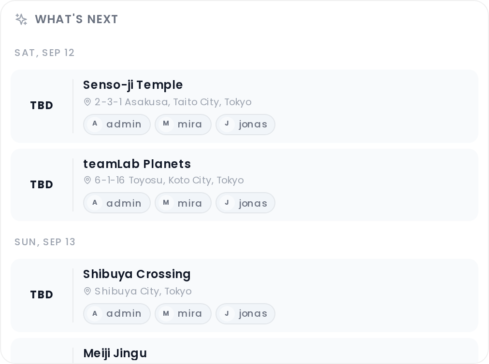

# What's Next Widget

The What's Next widget shows the upcoming assigned places across all days of your trip at a glance — useful for quickly orienting the group before heading out.

## Where to find it

Open the trip planner → **Collab** tab. On **desktop** the widget appears as a panel (alongside Chat, Notes, and Polls). On **mobile** it appears as a tab labeled "What's Next" with a sparkle icon in the Collab tab bar. The Collab addon must be enabled and the What's Next sub-feature must be turned on. See [Real-Time-Collaboration](Real-Time-Collaboration).

## What it shows

The widget displays the next **8** upcoming place assignments across all trip days, sorted by date and time. Entries are included if they fall on a future day, or if they fall on today and either have no time set (TBD) or have a start time that is still in the future. Past entries are excluded.

Each entry shows:

- **Time** — the scheduled start time (or "TBD" if none is set), and the end time if one is set
- **Place name**
- **Address** — if one is stored on the place
- **Participant chips** — the members assigned to this place. If no specific participants are assigned, all trip members are shown instead.

Entries are grouped by date with day headers: **Today**, **Tomorrow**, or the formatted weekday and date for further-out days. If a day has a title set, it appears after the date label.

## When it updates

The widget reflects the current trip data in real time — when you or another member adds, edits, or removes a day assignment, the list updates automatically without a page refresh.

## Requirements

- Collab addon enabled (admin)
- What's Next sub-feature enabled (admin)
- The trip must have days with place assignments that have future dates or times

## Related pages

[Real-Time-Collaboration](Real-Time-Collaboration) · [Collab-Chat](Collab-Chat) · [Day-Plans-and-Notes](Day-Plans-and-Notes)
